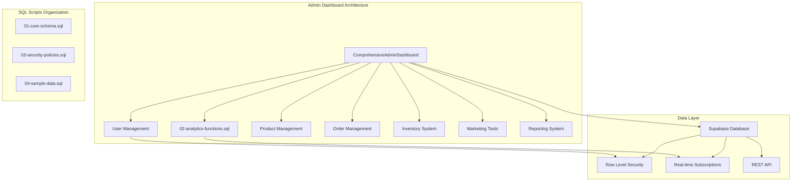

# Complete Admin Dashboard Implementation Guide

## Overview

This comprehensive guide provides a detailed, step-by-step implementation plan for enhancing the existing admin dashboard system in the advanced multi-role e-commerce platform. The implementation focuses on creating fully functional components with Supabase integration, real-time data updates, and enterprise-level features.

## Technology Stack & Integration

- **Frontend**: React 19 with TypeScript, Tailwind CSS
- **Backend**: Supabase (PostgreSQL + Auth + Real-time)
- **State Management**: React Context API
- **Charts & Analytics**: Recharts, custom visualization components
- **Real-time**: Supabase WebSocket subscriptions
- **File Operations**: CSV/Excel import/export capabilities

## Architecture Overview



## Database Schema & SQL Scripts Organization

### SQL Scripts Directory Structure

Create directory: `/supabase-scripts/admin-dashboard/`

```
supabase-scripts/
└── admin-dashboard/
    ├── 01-core-schema.sql           # Core database tables and relationships
    ├── 02-analytics-functions.sql   # Analytics and reporting functions
    ├── 03-security-policies.sql     # RLS policies and security measures
    ├── 04-sample-data.sql          # Sample data for testing
    ├── 05-user-management.sql      # User management functions
    ├── 06-product-functions.sql    # Product management procedures
    ├── 07-order-management.sql     # Order processing functions
    ├── 08-inventory-functions.sql  # Inventory management procedures
    ├── 09-marketing-functions.sql  # Marketing and promotion tools
    ├── 10-reporting-functions.sql  # Advanced reporting procedures
    └── README.md                   # Execution order and instructions
```

## Phase 1: Analytics & Overview Enhancement

### Step 1: Enhance Overview Analytics

#### Component Enhancement: ComprehensiveAdminDashboard.tsx

**Objective**: Transform the existing overview into a real-time business intelligence dashboard

**Key Features**:
- Real-time metrics integration with Supabase
- Dynamic KPI cards with percentage changes
- Interactive dashboard widgets
- Export functionality for analytics data
- Performance monitoring and optimization

**Implementation Tasks**:

1. **Real-time Metrics Integration**
```typescript
interface DashboardMetrics {
  totalUsers: number;
  totalProducts: number;
  totalOrders: number;
  totalRevenue: number;
  pendingOrders: number;
  lowStockProducts: number;
  newUsersToday: number;
  ordersToday: number;
  revenueToday: number;
  conversionRate: number;
}
```

2. **KPI Enhancement with Trends**
- Add percentage change calculations (day/week/month)
- Implement trend indicators (up/down arrows with colors)
- Create comparison periods (yesterday, last week, last month)

3. **Interactive Widgets**
- Click-through navigation to detailed views
- Hover tooltips with additional information
- Expandable widget content

4. **Real-time Updates**
- WebSocket subscriptions for live data
- Auto-refresh capabilities
- Real-time notifications for critical events

#### SQL Script: 01-core-schema.sql

**Core Tables Enhancement**:
```sql
-- Analytics tracking table
CREATE TABLE dashboard_analytics (
  id UUID PRIMARY KEY DEFAULT gen_random_uuid(),
  metric_name TEXT NOT NULL,
  metric_value NUMERIC NOT NULL,
  metric_date DATE NOT NULL DEFAULT CURRENT_DATE,
  created_at TIMESTAMP WITH TIME ZONE DEFAULT NOW()
);

-- Performance metrics table
CREATE TABLE performance_metrics (
  id UUID PRIMARY KEY DEFAULT gen_random_uuid(),
  component_name TEXT NOT NULL,
  load_time_ms INTEGER,
  query_count INTEGER,
  memory_usage_mb NUMERIC,
  recorded_at TIMESTAMP WITH TIME ZONE DEFAULT NOW()
);
```

### Step 2: Advanced Analytics Integration

#### Component Enhancement: EnhancedAnalytics.tsx

**Business Intelligence Features**:

1. **Sales Performance Analytics**
- Revenue trend charts (daily/weekly/monthly)
- Product performance matrices
- Category analysis dashboards
- Seasonal sales patterns

2. **User Behavior Analytics**
- Page view tracking and heatmaps
- Conversion funnel analysis
- User journey visualization
- Customer segmentation insights

3. **Geographic Distribution**
- Sales by region/country maps
- Shipping cost analysis by location
- Market penetration metrics

4. **Time-based Filtering System**
- Custom date range pickers
- Predefined periods (today, week, month, quarter, year)
- Comparative analysis tools

5. **Advanced Analytics Features**
- Cohort analysis implementation
- Customer lifetime value calculations
- Predictive analytics for sales forecasting
- A/B testing results integration

#### SQL Script: 02-analytics-functions.sql

**Analytics Functions**:
```sql
-- Sales analytics function
CREATE OR REPLACE FUNCTION get_sales_analytics(
  start_date DATE DEFAULT CURRENT_DATE - INTERVAL '30 days',
  end_date DATE DEFAULT CURRENT_DATE
) RETURNS TABLE (
  date DATE,
  revenue NUMERIC,
  orders INTEGER,
  average_order_value NUMERIC
) AS $$
BEGIN
  RETURN QUERY
  SELECT 
    o.created_at::DATE,
    SUM(oi.price * oi.quantity) as revenue,
    COUNT(DISTINCT o.id)::INTEGER as orders,
    AVG(o.total_amount) as average_order_value
  FROM orders o
  JOIN order_items oi ON o.id = oi.order_id
  WHERE o.created_at::DATE BETWEEN start_date AND end_date
  GROUP BY o.created_at::DATE
  ORDER BY o.created_at::DATE;
END;
$$ LANGUAGE plpgsql SECURITY DEFINER;
```

## Phase 2: User Management System

### Step 3: Complete User Management

#### Component Enhancement: UserManagement.tsx

**Advanced User Management Features**:

1. **Comprehensive CRUD Operations**
- Advanced user search with multiple filters
- Bulk operations (delete, role assignment, status updates)
- User profile detailed editing
- Account status management (active, suspended, banned)

2. **Role Management System**
- Dynamic role promotion/demotion
- Permission matrix visualization
- Role-based access control management
- Custom role creation capabilities

3. **User Activity Tracking**
- Login/logout history with IP tracking
- User action audit logs
- Security event monitoring
- Session management and timeout controls

4. **Advanced Features**
- User data export (GDPR compliance)
- Bulk user import from CSV/Excel
- User communication tools (notifications, emails)
- Account verification status management

#### Implementation Structure:

```typescript
interface UserManagementState {
  users: User[];
  filteredUsers: User[];
  selectedUsers: Set<string>;
  searchFilters: UserSearchFilters;
  sortConfig: SortConfig;
  pagination: PaginationState;
  bulkOperations: BulkOperationState;
}

interface UserSearchFilters {
  searchTerm: string;
  roleFilter: 'all' | 'admin' | 'seller' | 'customer';
  statusFilter: 'all' | 'active' | 'suspended' | 'banned';
  dateRange: { start: Date; end: Date };
  emailVerified: boolean | null;
}
```

#### SQL Script: 05-user-management.sql

**User Management Functions**:
```sql
-- Advanced user search function
CREATE OR REPLACE FUNCTION search_users_advanced(
  search_term TEXT DEFAULT '',
  role_filter TEXT DEFAULT 'all',
  status_filter TEXT DEFAULT 'all',
  limit_count INTEGER DEFAULT 50,
  offset_count INTEGER DEFAULT 0
) RETURNS TABLE (
  id UUID,
  full_name TEXT,
  email TEXT,
  role TEXT,
  is_active BOOLEAN,
  last_login TIMESTAMP WITH TIME ZONE,
  created_at TIMESTAMP WITH TIME ZONE
) AS $$
BEGIN
  RETURN QUERY
  SELECT 
    p.id,
    p.full_name,
    p.email,
    p.role,
    p.is_active,
    p.last_login,
    p.created_at
  FROM profiles p
  WHERE 
    (search_term = '' OR p.full_name ILIKE '%' || search_term || '%' OR p.email ILIKE '%' || search_term || '%')
    AND (role_filter = 'all' OR p.role = role_filter)
    AND (status_filter = 'all' OR 
         (status_filter = 'active' AND p.is_active = true) OR
         (status_filter = 'suspended' AND p.is_active = false))
  ORDER BY p.created_at DESC
  LIMIT limit_count OFFSET offset_count;
END;
$$ LANGUAGE plpgsql SECURITY DEFINER;
```

### Step 4: User Profile Management

#### Advanced Profile Management Features

1. **Detailed Profile Editor**
- Rich text profile descriptions
- Multi-language support
- Custom field management
- Profile image upload and management

2. **User Preferences Management**
- Notification preferences
- Privacy settings
- Theme and display preferences
- Communication preferences

3. **Communication Tools**
- Direct messaging system
- Bulk email campaigns
- Notification broadcasting
- SMS integration capabilities

4. **Verification and Compliance**
- Email verification workflow
- Phone number verification
- Identity document verification
- GDPR compliance tools (data export, deletion)

## Phase 3: Product Management Enhancement

### Step 5: Advanced Product Management

#### Component Enhancement: ProductManagement.tsx

**Advanced Product Features**:

1. **Comprehensive Product Operations**
- Advanced search with attribute-specific filters
- Bulk product operations (import, update, delete)
- Product category hierarchy management
- Multi-image management with optimization

2. **Product Variant System**
- Size, color, and concentration variations
- Stock tracking per variant
- Pricing strategies per variant
- Variant-specific SEO management

3. **SEO and Marketing Integration**
- Meta title and description management
- Keyword optimization tools
- Product placement controls (featured, deals, homepage)
- Social media integration

4. **Analytics Integration**
- Product performance tracking
- View and conversion analytics
- Inventory optimization suggestions
- Sales trend analysis

#### SQL Script: 06-product-functions.sql

**Product Management Procedures**:
```sql
-- Product analytics function
CREATE OR REPLACE FUNCTION get_product_analytics(
  product_id UUID DEFAULT NULL,
  date_range_days INTEGER DEFAULT 30
) RETURNS TABLE (
  product_id UUID,
  product_name TEXT,
  total_views INTEGER,
  total_sales INTEGER,
  conversion_rate NUMERIC,
  revenue NUMERIC
) AS $$
BEGIN
  RETURN QUERY
  SELECT 
    p.id as product_id,
    p.name as product_name,
    COALESCE(pv.view_count, 0)::INTEGER as total_views,
    COALESCE(ps.sale_count, 0)::INTEGER as total_sales,
    CASE 
      WHEN COALESCE(pv.view_count, 0) > 0 
      THEN (COALESCE(ps.sale_count, 0)::NUMERIC / pv.view_count) * 100
      ELSE 0 
    END as conversion_rate,
    COALESCE(ps.total_revenue, 0) as revenue
  FROM products p
  LEFT JOIN (
    SELECT 
      product_id,
      COUNT(*) as view_count
    FROM product_views 
    WHERE created_at >= CURRENT_DATE - INTERVAL '1 day' * date_range_days
    GROUP BY product_id
  ) pv ON p.id = pv.product_id
  LEFT JOIN (
    SELECT 
      oi.product_id,
      COUNT(*) as sale_count,
      SUM(oi.price * oi.quantity) as total_revenue
    FROM order_items oi
    JOIN orders o ON oi.order_id = o.id
    WHERE o.created_at >= CURRENT_DATE - INTERVAL '1 day' * date_range_days
    GROUP BY oi.product_id
  ) ps ON p.id = ps.product_id
  WHERE (product_id IS NULL OR p.id = product_id)
  ORDER BY revenue DESC;
END;
$$ LANGUAGE plpgsql SECURITY DEFINER;
```

### Step 6: Product Analytics & Optimization

#### Advanced Analytics Features

1. **Performance Analytics Dashboard**
- Product view tracking and heatmaps
- Sales conversion funnels
- Customer journey analysis
- A/B testing for product descriptions

2. **Inventory Intelligence**
- Automated low-stock alerts
- Reorder point optimization
- Seasonal demand forecasting
- Dead stock identification

3. **Recommendation Engine Management**
- AI-powered product suggestions
- Cross-selling optimization
- Customer behavior analysis
- Personalization algorithms

4. **Review and Rating System**
- Sentiment analysis of reviews
- Review moderation tools
- Rating trend analysis
- Customer feedback insights

## Phase 4: Order Management System

### Step 7: Comprehensive Order Management

#### Component Enhancement: OrderManager.tsx

**Complete Order Lifecycle Management**:

1. **Order Status Tracking**
- Real-time status updates (pending → confirmed → processing → shipped → delivered)
- Automated workflow triggers
- Customer notification system
- Delivery confirmation tracking

2. **Advanced Order Operations**
- Order modification capabilities
- Partial order fulfillment
- Return and refund processing
- Order cancellation workflows

3. **Customer Service Integration**
- Order communication history
- Customer support ticket integration
- Issue escalation workflows
- Service level agreement monitoring

4. **Batch Processing**
- Bulk order processing
- Automated order routing
- Print management for shipping labels
- Export capabilities for fulfillment centers

#### SQL Script: 07-order-management.sql

**Order Management Functions**:
```sql
-- Order status update function with notifications
CREATE OR REPLACE FUNCTION update_order_status(
  order_id UUID,
  new_status TEXT,
  admin_notes TEXT DEFAULT NULL
) RETURNS BOOLEAN AS $$
DECLARE
  old_status TEXT;
  customer_id UUID;
BEGIN
  -- Get current status and customer
  SELECT status, user_id INTO old_status, customer_id
  FROM orders WHERE id = order_id;
  
  -- Update order status
  UPDATE orders 
  SET 
    status = new_status,
    updated_at = NOW()
  WHERE id = order_id;
  
  -- Log status change
  INSERT INTO order_status_history (
    order_id,
    old_status,
    new_status,
    admin_notes,
    changed_at
  ) VALUES (
    order_id,
    old_status,
    new_status,
    admin_notes,
    NOW()
  );
  
  -- Send notification to customer
  INSERT INTO notifications (
    user_id,
    title,
    message,
    type,
    metadata
  ) VALUES (
    customer_id,
    'Order Status Updated',
    'Your order status has been updated to: ' || new_status,
    'order_update',
    jsonb_build_object('order_id', order_id, 'status', new_status)
  );
  
  RETURN TRUE;
EXCEPTION
  WHEN OTHERS THEN
    RETURN FALSE;
END;
$$ LANGUAGE plpgsql SECURITY DEFINER;
```

### Step 8: Order Analytics & Reporting

#### Advanced Order Analytics

1. **Order Volume Analytics**
- Daily/weekly/monthly order trends
- Peak ordering times analysis
- Seasonal pattern identification
- Geographic order distribution

2. **Financial Analytics**
- Average order value tracking
- Revenue per customer analysis
- Profit margin calculations
- Payment method performance

3. **Fulfillment Analytics**
- Order processing time analysis
- Shipping performance metrics
- Delivery success rates
- Customer satisfaction tracking

4. **Export and Integration**
- CSV/PDF invoice generation
- Accounting system integration
- ERP system data exchange
- Custom report generation

## Phase 5: Inventory Management

### Step 9: Real-time Inventory System

#### Component Enhancement: InventoryManagement.tsx

**Advanced Inventory Features**:

1. **Real-time Stock Tracking**
- Live inventory updates across all channels
- Multi-warehouse inventory management
- Real-time stock level synchronization
- Automated reorder point calculations

2. **Inventory Movement Tracking**
- Detailed transaction logs (in/out/adjustments)
- Supplier performance tracking
- Cost analysis and margin calculations
- Inventory valuation reports

3. **Forecasting and Planning**
- Demand forecasting algorithms
- Seasonal adjustment calculations
- Lead time optimization
- Safety stock recommendations

4. **Supplier Integration**
- Automated purchase order generation
- Supplier performance scorecards
- Cost comparison tools
- Delivery tracking integration

#### SQL Script: 08-inventory-functions.sql

**Inventory Management Procedures**:
```sql
-- Inventory movement tracking function
CREATE OR REPLACE FUNCTION log_inventory_movement(
  product_id UUID,
  movement_type TEXT, -- 'in', 'out', 'adjustment'
  quantity INTEGER,
  reason TEXT,
  reference_id UUID DEFAULT NULL
) RETURNS BOOLEAN AS $$
DECLARE
  current_stock INTEGER;
  new_stock INTEGER;
BEGIN
  -- Get current stock
  SELECT stock INTO current_stock FROM products WHERE id = product_id;
  
  -- Calculate new stock level
  CASE movement_type
    WHEN 'in' THEN new_stock := current_stock + quantity;
    WHEN 'out' THEN new_stock := current_stock - quantity;
    WHEN 'adjustment' THEN new_stock := quantity;
    ELSE RAISE EXCEPTION 'Invalid movement type: %', movement_type;
  END CASE;
  
  -- Update product stock
  UPDATE products SET 
    stock = new_stock,
    updated_at = NOW()
  WHERE id = product_id;
  
  -- Log the movement
  INSERT INTO inventory_movements (
    product_id,
    movement_type,
    quantity_change,
    old_quantity,
    new_quantity,
    reason,
    reference_id,
    created_at
  ) VALUES (
    product_id,
    movement_type,
    CASE movement_type
      WHEN 'in' THEN quantity
      WHEN 'out' THEN -quantity
      WHEN 'adjustment' THEN quantity - current_stock
    END,
    current_stock,
    new_stock,
    reason,
    reference_id,
    NOW()
  );
  
  -- Check for low stock alerts
  IF new_stock <= (SELECT min_stock_level FROM products WHERE id = product_id) THEN
    INSERT INTO stock_alerts (
      product_id,
      alert_type,
      message,
      created_at
    ) VALUES (
      product_id,
      'low_stock',
      'Product stock is below minimum level: ' || new_stock,
      NOW()
    );
  END IF;
  
  RETURN TRUE;
EXCEPTION
  WHEN OTHERS THEN
    RETURN FALSE;
END;
$$ LANGUAGE plpgsql SECURITY DEFINER;
```

### Step 10: Inventory Analytics

#### Advanced Inventory Intelligence

1. **Turnover Analysis**
- Inventory turnover rate calculations
- Dead stock identification algorithms
- Fast/slow-moving product classification
- Seasonal demand pattern analysis

2. **Cost Optimization**
- Carrying cost analysis
- Order quantity optimization
- Supplier cost comparison
- Total cost of ownership calculations

3. **Performance Metrics**
- Stock accuracy measurements
- Fill rate optimization
- Cycle count efficiency
- Shrinkage tracking and analysis

4. **Predictive Analytics**
- Demand forecasting models
- Seasonal adjustment algorithms
- Lead time variability analysis
- Safety stock optimization

## Implementation Timeline & Priorities

### Critical Phase (Weeks 1-4)
- **Phase 1**: Analytics & Overview Enhancement
- **Phase 2**: User Management System
- **Database Scripts**: 01-05 implementation

### High Priority Phase (Weeks 5-8)
- **Phase 3**: Product Management Enhancement
- **Phase 4**: Order Management System
- **Database Scripts**: 06-07 implementation

### Medium Priority Phase (Weeks 9-12)
- **Phase 5**: Inventory Management
- **Phase 6**: Marketing & Promotion Tools
- **Database Scripts**: 08-09 implementation

### Advanced Features Phase (Weeks 13-16)
- **Phase 7-8**: Payment & Financial Management
- **Phase 9-10**: Reports & Business Intelligence
- **Database Scripts**: 10+ implementation

## Testing Strategy

### Unit Testing Requirements
- Component-level testing for all enhanced components
- Database function testing with mock data
- API integration testing with Supabase
- Error handling and edge case validation

### Integration Testing
- End-to-end workflow testing
- Real-time feature validation
- Cross-component data flow testing
- Performance testing under load

### User Acceptance Testing
- Role-based access control validation
- Business workflow verification
- UI/UX consistency checking
- Mobile responsiveness testing

## Performance Optimization

### Database Optimization
- Query performance monitoring
- Index optimization strategies
- Connection pooling implementation
- Caching layer integration

### Frontend Optimization
- Component lazy loading
- Code splitting strategies
- State management optimization
- Bundle size optimization

### Real-time Features
- WebSocket connection optimization
- Event throttling and debouncing
- Memory leak prevention
- Connection resilience strategies

## Security Considerations

### Data Protection
- Row Level Security (RLS) policy implementation
- Data encryption at rest and in transit
- Input validation and sanitization
- SQL injection prevention

### Access Control
- Role-based permission matrices
- API rate limiting implementation
- Session management and timeouts
- Audit logging for all admin actions

### Compliance
- GDPR compliance tools
- Data retention policy implementation
- User consent management
- Privacy control interfaces