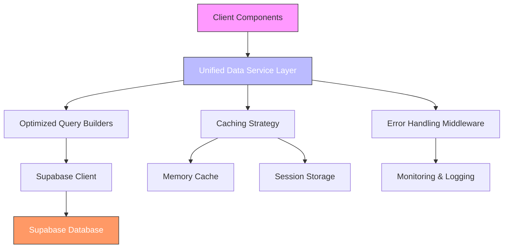
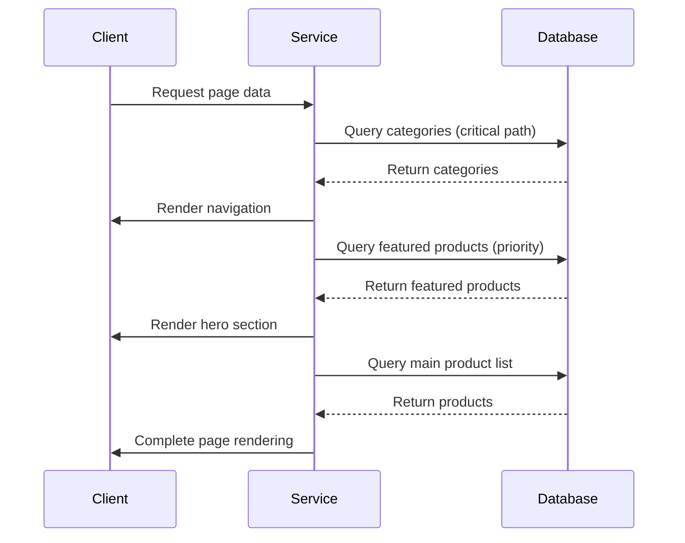

# Database Fetching Optimization Design

## Overview

This document outlines the strategic design for optimizing database fetching operations in the Supabase-backed application. The current implementation suffers from performance issues, inconsistent data retrieval patterns, and architectural fragmentation that impacts user experience and scalability.

The optimization strategy focuses on creating a unified, efficient, and maintainable data access layer that addresses the root causes of slow database responses while preparing the system for production deployment.

## Architecture

### Current Issues Analysis

1. **Code Duplication**: Multiple implementations of similar functionality exist across different files (`supabase.ts`, `crudOperations.ts`)
2. **Inconsistent Data Retrieval**: Different functions use varying select statements and transformation logic for the same entities
3. **Performance Bottlenecks**: 
   - Excessive data fetching with `*` selects
   - Lack of proper indexing on critical query fields
   - No query optimization or pagination strategies
4. **Error Handling Fragmentation**: Error handling is implemented differently across various data access functions
5. **Caching Inconsistency**: Multiple caching mechanisms with conflicting strategies

### Proposed Solution Architecture

The proposed architecture introduces a unified data service layer that acts as the single source of truth for all database interactions, eliminating code duplication and ensuring consistent behavior across the application.

## API Endpoints Reference

### Product Data Endpoints

| Endpoint | Purpose | Authentication | Key Optimizations |
|----------|---------|----------------|-------------------|
| getProducts(filters) | Retrieve products with filtering capabilities | None (public) | Field selection optimization, pagination support, index-based queries |
| getProductById(id) | Get specific product by ID | None (public) | Direct key lookup, composite indexing |
| getProductBySlug(slug) | Get product by SEO-friendly slug | None (public) | Indexed slug lookup, reduced response payload |
| getFeaturedProducts(limit) | Retrieve featured products | None (public) | Pre-filtered query, limited field selection |
| getCategories() | Get all active categories | None (public) | Sorted result set, minimal field selection |

### Authentication Requirements

All read operations for public content are accessible without authentication. Write operations and user-specific data retrieval require authenticated sessions through Supabase Auth.

## Data Models & ORM Mapping

### Product Model

| Field | Type | Index | Purpose |
|-------|------|-------|-------|
| id | UUID | Primary Key | Unique identifier |
| name | string | idx_products_name_trgm | Full-text search and filtering |
| price | decimal | idx_products_price_range | Price-based filtering |
| category_id | UUID | idx_products_category_status | Category filtering and joins |
| featured | boolean | idx_products_featured_created_at | Featured product queries |
| active | boolean | idx_products_active_status | Soft delete pattern |
| created_at | timestamp | idx_products_created_at_desc | Chronological ordering |
| updated_at | timestamp | - | Audit trail |

### Category Model

| Field | Type | Index | Purpose |
|-------|------|-------|-------|
| id | UUID | Primary Key | Unique identifier |
| name | string | idx_categories_name | Filtering and display |
| slug | string | idx_categories_slug (unique) | SEO-friendly URLs |
| active | boolean | idx_categories_active | Active/inactive filtering |
| sort_order | integer | idx_categories_sort_order | Custom sorting |

## Business Logic Layer

### Data Fetching Strategy

#### Staged Loading Approach

The staged loading approach prioritizes critical rendering elements first, allowing the UI to become interactive quickly while non-critical data loads in the background.

#### Query Optimization Principles

1. **Minimal Field Selection**: Only request fields that are actually needed for the current view
2. **Filter Pushdown**: Apply filters at the database level rather than in client-side code
3. **Index Utilization**: Ensure all query predicates use appropriate indexes
4. **Pagination**: Implement cursor-based pagination for large datasets
5. **Batch Operations**: Combine related queries into single requests when possible

### Caching Strategy

| Cache Level | Duration | Scope | Purpose |
|-----------|---------|-------|---------|
| Memory | 5 minutes | Session | High-frequency access to recently viewed items |
| Session Storage | Browser session | User | Persistence across page reloads |
| CDN | 1 hour | Global | Static assets and public content |

Cache invalidation occurs on:
- Data mutations (create, update, delete)
- Explicit refresh requests
- Time-based expiration

## Middleware & Interceptors

### Performance Monitoring Middleware

Implements automatic tracking of:

- Query execution time
- Network latency
- Cache hit/miss ratios
- Error rates by operation type

Collected metrics feed into a monitoring dashboard for proactive performance management.

### Retry Mechanism

Configurable retry policy with exponential backoff for transient failures:

- Initial delay: 100ms
- Maximum retries: 3
- Backoff multiplier: 2x
- Timeout: 10 seconds per operation

### Rate Limiting

Prevents abuse and ensures fair resource allocation:

- Anonymous users: 100 requests/minute
- Authenticated users: 300 requests/minute
- Admin operations: 50 requests/minute

## Testing

### Unit Test Coverage

| Component | Test Cases | Coverage Target |
|---------|------------|----------------|
| Query Builders | 15+ scenarios | 95%+
| Caching Layer | 8+ scenarios | 90%+
| Error Handling | 10+ error cases | 100%
| Data Transformation | 12+ edge cases | 95%+
| Performance Utils | 6+ benchmarks | N/A |

### Integration Testing

Simulates real-world usage patterns with:

- Concurrent user scenarios
- Network latency injection
- Database load testing
- Cache eviction simulations
- Error recovery workflows