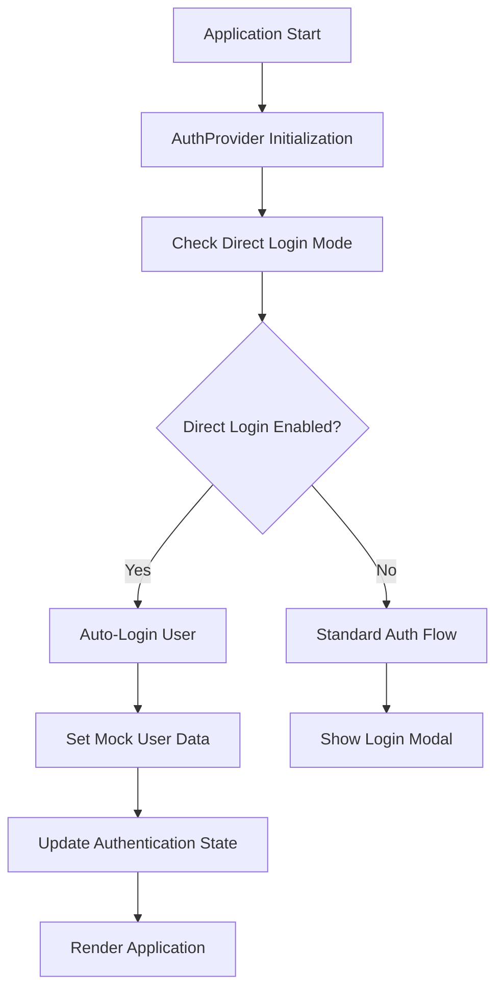
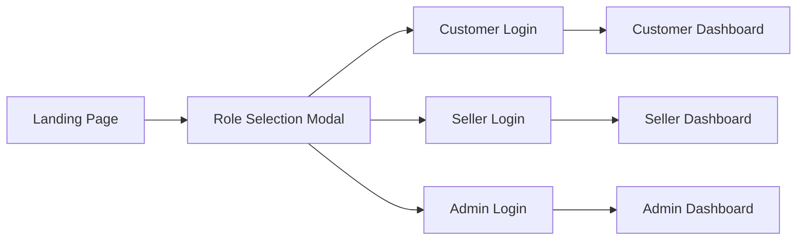
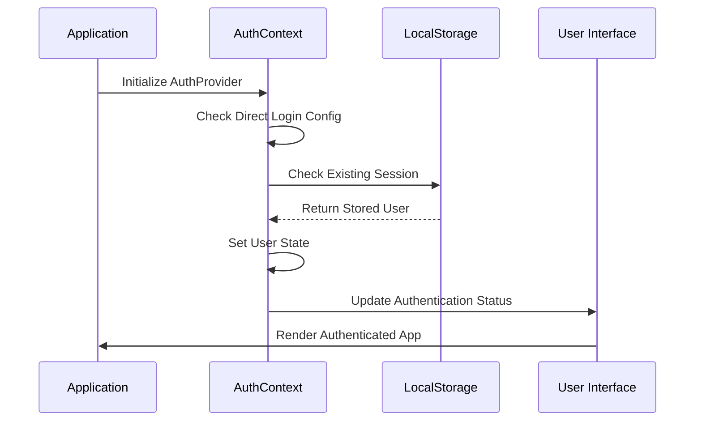
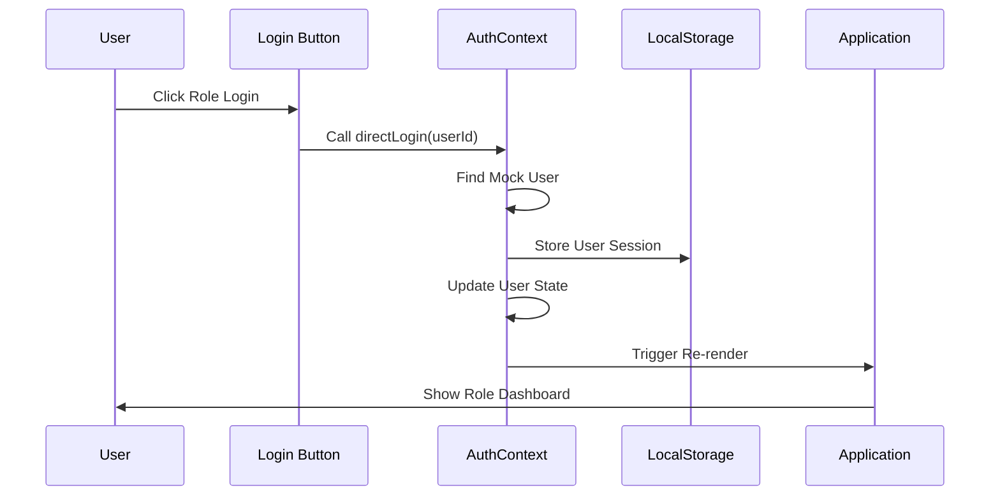

# Direct Login Without Credentials - Design Document

## Overview

This document outlines the design for implementing a direct login system that bypasses traditional authentication mechanisms, allowing users to be automatically logged in without providing credentials. This approach is suitable for development environments, demos, or specific use cases where security is not a primary concern.

## Technology Stack & Dependencies

The implementation leverages the existing React/TypeScript frontend with:
- **React Context API**: Modified AuthContext for direct authentication
- **Supabase**: Backend authentication service (bypassed for direct login)
- **TypeScript**: Type safety for authentication interfaces
- **Local Storage**: Session persistence for direct login state

## Component Architecture

### Modified Authentication Flow



### Component Modifications

**AuthContext Updates:**
- Add direct login configuration flag
- Implement mock user creation
- Bypass Supabase authentication calls
- Maintain existing interface compatibility

**Application Flow:**
- Detect direct login mode at startup
- Create default user profiles
- Skip authentication modals
- Provide role selection interface (optional)

## Direct Login Implementation Strategy

### 1. Configuration-Based Approach

Add environment variable to control direct login:

```typescript
interface DirectLoginConfig {
  enabled: boolean;
  defaultRole: 'customer' | 'seller' | 'admin';
  mockUsers: MockUser[];
  autoSelectUser?: string;
}
```

### 2. Mock User Data Structure

```typescript
interface MockUser extends User {
  id: string;
  name: string;
  email: string;
  role: 'admin' | 'seller' | 'customer';
  avatar?: string;
  phone?: string;
  dateOfBirth?: string;
  isActive: boolean;
  emailVerified: boolean;
  createdAt: Date;
}
```

### 3. AuthContext Modifications

**Direct Login Method:**
```typescript
const directLogin = async (userId?: string): Promise<void> => {
  if (!directLoginConfig.enabled) return;
  
  const selectedUser = userId 
    ? mockUsers.find(u => u.id === userId)
    : mockUsers.find(u => u.role === directLoginConfig.defaultRole);
    
  if (selectedUser) {
    setUser(selectedUser);
    localStorage.setItem('direct_login_user', JSON.stringify(selectedUser));
  }
};
```

**Session Recovery:**
```typescript
const recoverDirectLoginSession = (): User | null => {
  const storedUser = localStorage.getItem('direct_login_user');
  return storedUser ? JSON.parse(storedUser) : null;
};
```

## User Interface Components

### Role Selection Interface (Optional)



**Features:**
- Role-based quick login buttons
- Pre-configured user profiles for each role
- Visual role indicators
- Instant authentication

### Direct Login Button Component

```typescript
interface DirectLoginButtonProps {
  role: 'customer' | 'seller' | 'admin';
  userProfile?: MockUser;
  onLogin: (user: MockUser) => void;
  className?: string;
}
```

## State Management Integration

### AuthContext Extensions

```typescript
interface ExtendedAuthContextType extends AuthContextType {
  directLogin: (userId?: string) => Promise<void>;
  isDirectLoginMode: boolean;
  availableUsers: MockUser[];
  switchUser: (userId: string) => Promise<void>;
}
```

### Mock Data Management

**Default User Profiles:**
- **Customer**: Basic customer with shopping history
- **Seller**: Seller with product inventory
- **Admin**: Administrator with full permissions

```typescript
const defaultMockUsers: MockUser[] = [
  {
    id: 'mock-customer-1',
    name: 'John Customer',
    email: 'customer@example.com',
    role: 'customer',
    avatar: '/assets/customer-avatar.png',
    isActive: true,
    emailVerified: true,
    createdAt: new Date()
  },
  {
    id: 'mock-seller-1',
    name: 'Jane Seller',
    email: 'seller@example.com',
    role: 'seller',
    avatar: '/assets/seller-avatar.png',
    isActive: true,
    emailVerified: true,
    createdAt: new Date()
  },
  {
    id: 'mock-admin-1',
    name: 'Admin User',
    email: 'admin@example.com',
    role: 'admin',
    avatar: '/assets/admin-avatar.png',
    isActive: true,
    emailVerified: true,
    createdAt: new Date()
  }
];
```

## Data Flow Architecture

### Authentication State Flow



### User Switching Flow



## Security Considerations

### Development Mode Safety

**Environment Restrictions:**
- Direct login only enabled in development mode
- Clear warnings in production builds
- Automatic disabling in production environments

**Configuration Validation:**
```typescript
const validateDirectLoginConfig = (): boolean => {
  if (process.env.NODE_ENV === 'production' && directLoginConfig.enabled) {
    console.error('Direct login cannot be enabled in production');
    return false;
  }
  return true;
};
```

### Data Protection

**Mock Data Handling:**
- No real credentials stored
- Clear session data on logout
- Temporary user identifiers only
- No persistent authentication tokens

## Implementation Requirements

### Environment Configuration

```typescript
// Environment Variables
VITE_DIRECT_LOGIN_ENABLED=true
VITE_DIRECT_LOGIN_DEFAULT_ROLE=customer
VITE_DIRECT_LOGIN_AUTO_SELECT=false
```

### Code Modifications Required

1. **AuthContext.tsx**: Add direct login logic
2. **App.tsx**: Initialize direct login mode
3. **Types/index.ts**: Extend authentication interfaces
4. **Header.tsx**: Modify login/logout buttons
5. **Layout.tsx**: Add role selection interface

### Backward Compatibility

**Existing Feature Preservation:**
- All current authentication methods remain functional
- Direct login as optional enhancement
- No breaking changes to existing interfaces
- Graceful fallback to standard authentication

## Testing Strategy

### Unit Testing

**AuthContext Tests:**
- Direct login functionality
- User switching mechanics
- Session persistence
- Configuration validation

**Component Tests:**
- Role selection interface
- Login button interactions
- Authentication state updates
- Error handling scenarios

### Integration Testing

**End-to-End Scenarios:**
- Direct login flow completion
- Role-based dashboard access
- User switching between roles
- Session recovery on page reload

### Manual Testing Checklist

- [ ] Direct login works for all roles
- [ ] Dashboard routing based on role
- [ ] User profile displays correctly
- [ ] Cart/wishlist persistence across roles
- [ ] Logout functionality
- [ ] Production mode disabling
- [ ] Session recovery after refresh

## Performance Optimizations

### Loading Time Improvements

**Instant Authentication:**
- Skip network requests for authentication
- Immediate user state initialization
- Faster application startup
- Reduced time to interactive

**Memory Efficiency:**
- Minimal mock data storage
- Efficient state updates
- Optimized re-rendering patterns
- Lazy loading of role-specific data

### Caching Strategy

**Session Persistence:**
- Local storage for user sessions
- Role preferences caching
- Quick user switching
- Offline functionality support

## Migration Path

### Enabling Direct Login

1. **Update Environment Configuration**
2. **Modify AuthContext Implementation**
3. **Add Role Selection Components**
4. **Update Application Initialization**
5. **Test All User Roles**

### Disabling Direct Login

1. **Remove Environment Variables**
2. **Revert to Standard Authentication**
3. **Clear Direct Login Sessions**
4. **Restore Login Modals**

## Error Handling

### Configuration Errors

```typescript
const handleDirectLoginError = (error: DirectLoginError): void => {
  switch (error.type) {
    case 'PRODUCTION_MODE':
      console.error('Direct login disabled in production');
      break;
    case 'INVALID_USER':
      console.error('Invalid user configuration');
      break;
    case 'MISSING_CONFIG':
      console.error('Direct login configuration missing');
      break;
  }
};
```

### Runtime Error Handling

**Fallback Mechanisms:**
- Graceful degradation to standard auth
- Clear error messages for users
- Automatic recovery strategies
- Comprehensive logging