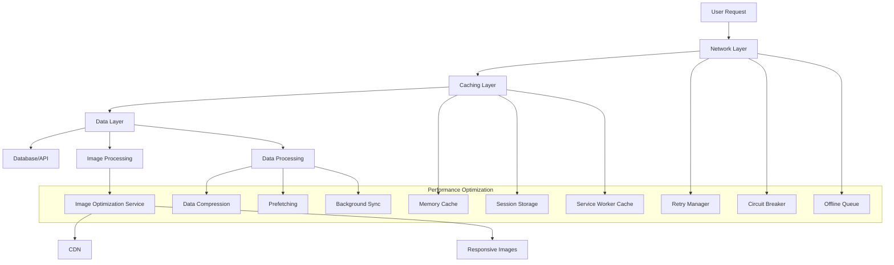

# Image and Data Loading Optimization Design

## Overview

This document outlines a comprehensive strategy to optimize image and data loading performance in the perfumes e-commerce application. The current implementation suffers from slow loading times for both images and data, which negatively impacts user experience and conversion rates. This design addresses the root causes and provides a systematic approach to resolve these performance issues.

## Current Performance Issues Analysis

Based on the codebase analysis, the following key issues contribute to slow loading times:

1. **Inefficient Image Loading**
   - Lack of proper image optimization (format, size, compression)
   - No progressive loading or lazy loading implementation
   - Missing responsive image handling
   - No CDN or caching strategy for images

2. **Suboptimal Data Fetching**
   - Inefficient caching mechanisms with short TTL values
   - Lack of background data synchronization
   - No prefetching or preloading strategies
   - Absence of data compression for API responses

3. **Network Resilience Issues**
   - Limited retry mechanisms for failed requests
   - No circuit breaker pattern implementation
   - Insufficient offline support
   - Lack of bandwidth-aware loading strategies

4. **Resource Management**
   - No request prioritization
   - Missing resource bundling and compression
   - Inefficient component rendering
   - Absence of memory management strategies

## Proposed Architecture

## Optimization Strategies

### 1. Image Loading Optimization

#### a. Modern Image Formats
Implement automatic format selection based on browser support:
- AVIF for modern browsers (best compression)
- WebP as fallback (good compression)
- JPEG/PNG as final fallback

#### b. Responsive Images
- Generate multiple sizes of each image
- Use `srcset` and `sizes` attributes
- Implement device pixel ratio awareness

#### c. Progressive Loading
- Implement blur-up technique with low-quality placeholders
- Add skeleton loaders for image containers
- Use intersection observer for lazy loading

#### d. Caching Strategy
- Implement HTTP caching headers
- Use service workers for offline image caching
- Add cache-busting for updated images

### 2. Data Loading Optimization

#### a. Intelligent Caching
Enhance the existing caching system with:
- Longer TTL values for static data
- Stale-while-revalidate strategy for critical data
- Cache warming for frequently accessed resources
- Tag-based cache invalidation

#### b. Data Prefetching
- Implement predictive prefetching based on user behavior
- Preload next page data during idle time
- Cache essential data on app initialization

#### c. Request Optimization
- Bundle multiple requests into single API calls
- Implement request deduplication
- Add request prioritization (critical vs background)

#### d. Compression
- Enable GZIP/Brotli compression for API responses
- Implement data structure optimization
- Use pagination for large datasets

### 3. Network Resilience

#### a. Retry Mechanisms
- Exponential backoff for failed requests
- Configurable retry conditions
- Timeout handling for hanging requests

#### b. Circuit Breaker Pattern
- Prevent cascading failures
- Automatic recovery after timeout
- Monitoring and metrics collection

#### c. Offline Support
- Queue requests when offline
- Sync when connection is restored
- Inform users about offline status

### 4. Resource Management

#### a. Request Prioritization
- Critical resources (product images, prices) loaded first
- Non-critical resources (reviews, related products) loaded later
- Cancel low-priority requests when higher priority ones arrive

#### b. Memory Management
- Implement memory leak detection
- Clean up event listeners properly
- Use weak references where appropriate

## Implementation Plan

### Phase 1: Image Optimization (Week 1-2)
1. Implement responsive image component
2. Add format detection and conversion
3. Create image optimization service
4. Set up CDN integration

### Phase 2: Caching Enhancement (Week 2-3)
1. Extend cache TTL values
2. Implement stale-while-revalidate strategy
3. Add cache warming mechanism
4. Improve cache invalidation

### Phase 3: Network Resilience (Week 3-4)
1. Implement retry mechanisms
2. Add circuit breaker pattern
3. Enhance offline support
4. Create network status monitoring

### Phase 4: Performance Monitoring (Week 4-5)
1. Add detailed performance metrics
2. Implement user experience tracking
3. Create performance dashboard
4. Set up alerts for performance degradation

## Technical Specifications

### Image Component Enhancement

The optimized image component will support:
- Multiple modern image formats with automatic browser detection
- Responsive sizing with srcset and sizes attributes
- Quality control options for balancing visual quality and performance
- Priority loading for critical images
- Asynchronous decoding for non-blocking rendering

### Cache Configuration

Cache configurations will include:
- Strategy selection for different data types
- Time-to-live settings for expiration control
- Priority levels for resource management
- Tagging system for efficient invalidation
- Compression options for storage optimization

### Retry Configuration

Retry mechanisms will feature:
- Configurable maximum retry attempts
- Exponential backoff timing
- Timeout controls for hanging requests
- Error type filtering for selective retry

## Performance Metrics

Key metrics to monitor and improve:

1. **First Contentful Paint (FCP)** - Target: < 1.8 seconds
2. **Largest Contentful Paint (LCP)** - Target: < 2.5 seconds
3. **First Input Delay (FID)** - Target: < 100 milliseconds
4. **Cumulative Layout Shift (CLS)** - Target: < 0.1
5. **Time to Interactive (TTI)** - Target: < 3.8 seconds

## Risk Mitigation

1. **Progressive Enhancement**
   - Ensure core functionality works without JavaScript
   - Provide fallbacks for modern features

2. **Backward Compatibility**
   - Maintain support for older browsers
   - Test on various devices and network conditions

3. **Performance Monitoring**
   - Continuously monitor key metrics
   - Set up alerts for performance degradation
   - Regular performance audits

## Success Criteria

1. Reduce average page load time by 50%
2. Improve LCP by 40%
3. Achieve 99% success rate for data fetching
4. Reduce image loading time by 60%
5. Maintain < 100ms FID across all devices

## Testing Strategy

### Unit Tests
- Image format detection
- Cache mechanisms
- Retry logic
- Circuit breaker functionality

### Integration Tests
- End-to-end loading performance
- Offline functionality
- Error handling scenarios
- Cache invalidation

### Performance Tests
- Load testing with multiple concurrent users
- Network condition simulation
- Memory leak detection
- Bandwidth usage optimization

## Monitoring and Maintenance

1. **Real User Monitoring (RUM)**
   - Track actual user performance
   - Collect field data metrics
   - Identify performance bottlenecks

2. **Synthetic Monitoring**
   - Regular performance checks
   - Automated testing across devices
   - Alerting for performance degradation

3. **A/B Testing**
   - Compare optimization strategies
   - Measure impact on user engagement
   - Validate performance improvements