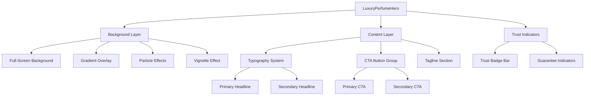
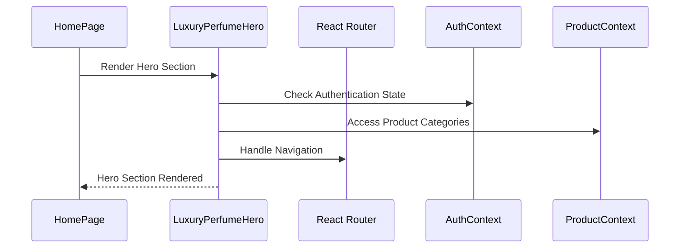
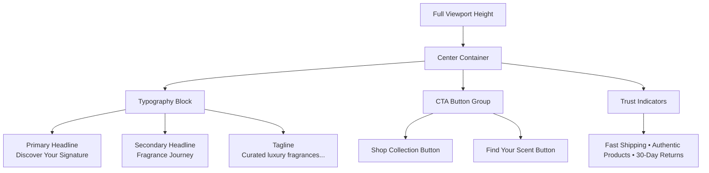

# Luxury Perfume Hero Section Design

## Overview

This design document outlines the complete replacement of the current hero section with a sophisticated luxury perfume e-commerce hero section. The new implementation will transform the existing general e-commerce hero into a specialized, visually stunning section optimized for luxury fragrance retail, emphasizing premium aesthetics, emotional connection, and conversion optimization.

## Architecture

### Component Structure

The luxury perfume hero section will be implemented as a comprehensive React component that replaces the existing `Hero.tsx` component while maintaining integration with the platform's existing architecture.



### Technical Foundation

The component will be built using the existing technology stack:

- **React 19** with TypeScript for type safety
- **Framer Motion** for sophisticated animations and particle effects
- **Tailwind CSS** with custom luxury design tokens
- **Lucide React** for minimalist icons
- **React Router** for navigation integration

### Integration Points



## Visual Design System

### Background & Visual Foundation

#### Full-Screen Background Composition
- **Primary Background**: High-resolution perfume bottle composition featuring crystal-clear glass bottles with golden/amber liquid
- **Lighting**: Soft dramatic lighting with professional studio setup creating subtle reflections and depth
- **Aspect Ratio**: 16:9 minimum, optimized for various viewport sizes
- **Resolution**: Minimum 1920x1080, with responsive scaling

#### Overlay System
```css
/* Dark gradient overlay for text readability */
background: linear-gradient(
  135deg,
  rgba(15, 23, 42, 0.85) 0%,
  rgba(30, 41, 59, 0.75) 25%,
  rgba(51, 65, 85, 0.65) 50%,
  rgba(30, 41, 59, 0.75) 75%,
  rgba(15, 23, 42, 0.85) 100%
);
```

#### Visual Effects
- **Bokeh Effects**: Subtle circular light spots using CSS and SVG animations
- **Light Rays**: Diagonal light beams using CSS gradients with opacity animations
- **Particle System**: Floating golden particles using Framer Motion for premium atmosphere
- **Vignette Effect**: Soft darkening around edges to focus attention on center content

### Color Palette

#### Primary Colors
- **Deep Navy**: `#0f172a` (Primary background tone)
- **Charcoal**: `#1e293b` (Secondary background)
- **Slate**: `#334155` (Tertiary elements)

#### Accent Colors
- **Champagne Gold**: `#d4af37` (Primary accent)
- **Rose Gold**: `#e8b4b8` (Secondary accent)
- **Warm Gold**: `#ffd700` (Hover states)

#### Text Colors
- **Pure White**: `#ffffff` (Primary text)
- **Light Gray**: `#f8fafc` (Secondary text)
- **Gold Text**: `#d4af37` (Accent text)

### Typography System

#### Font Hierarchy
```typescript
interface TypographyScale {
  primaryHeadline: {
    fontSize: '4.5rem';
    fontWeight: 700;
    lineHeight: 1.1;
    letterSpacing: '-0.02em';
    fontFamily: 'Playfair Display';
  };
  secondaryHeadline: {
    fontSize: '3.5rem';
    fontWeight: 400;
    lineHeight: 1.2;
    letterSpacing: '-0.01em';
    fontFamily: 'Playfair Display';
  };
  tagline: {
    fontSize: '1.25rem';
    fontWeight: 300;
    lineHeight: 1.6;
    letterSpacing: '0.02em';
    fontFamily: 'Inter';
  };
}
```

#### Content Specifications
- **Line 1**: "Discover Your Signature" (Primary headline style)
- **Line 2**: "Fragrance Journey" (Secondary headline style)
- **Tagline**: "Curated luxury fragrances from world's finest perfume houses"
- **Vertical Spacing**: 2rem between headline lines, 3rem to tagline, 4rem to CTAs

## Component Implementation

### Button System Design

#### Primary CTA Button
```typescript
interface PrimaryCTAProps {
  text: 'Shop Collection';
  backgroundColor: '#d4af37';
  textColor: '#0f172a';
  padding: '1rem 2.5rem';
  borderRadius: '0.75rem';
  fontSize: '1.125rem';
  fontWeight: 600;
  hoverEffect: 'golden-glow';
  animation: 'subtle-scale';
}
```

#### Secondary CTA Button
```typescript
interface SecondaryCTAProps {
  text: 'Find Your Scent';
  backgroundColor: 'transparent';
  border: '2px solid #d4af37';
  textColor: '#d4af37';
  padding: '1rem 2.5rem';
  borderRadius: '0.75rem';
  fontSize: '1.125rem';
  fontWeight: 500;
  hoverEffect: 'border-glow';
  animation: 'subtle-scale';
}
```

#### Button Animations
```css
/* Hover effects using Framer Motion */
.golden-glow {
  box-shadow: 0 0 30px rgba(212, 175, 55, 0.6);
  transform: scale(1.05);
  transition: all 0.3s ease-out;
}

.border-glow {
  box-shadow: 0 0 20px rgba(212, 175, 55, 0.4);
  background: rgba(212, 175, 55, 0.1);
  transform: scale(1.02);
  transition: all 0.3s ease-out;
}
```

### Layout Specifications

#### Desktop Layout (≥1024px)


#### Mobile Layout (≤768px)
- **Stacked Button Layout**: Buttons stack vertically with 1rem spacing
- **Reduced Typography Scale**: 75% of desktop font sizes
- **Adjusted Spacing**: Reduced vertical rhythm for mobile optimization
- **Touch Optimization**: Minimum 44px touch targets for buttons

### Responsive Breakpoints

```css
/* Mobile First Approach */
.luxury-hero-container {
  /* Base mobile styles */
  padding: 2rem 1rem;
  text-align: center;
}

@media (min-width: 640px) {
  .luxury-hero-container {
    padding: 3rem 2rem;
  }
}

@media (min-width: 768px) {
  .luxury-hero-container {
    padding: 4rem 3rem;
  }
}

@media (min-width: 1024px) {
  .luxury-hero-container {
    padding: 6rem 4rem;
    max-width: 1200px;
    margin: 0 auto;
  }
}
```

## Premium Interactive Elements

### Particle Effect System

#### Implementation Approach
```typescript
interface ParticleConfig {
  count: 30;
  size: {
    min: 2;
    max: 6;
  };
  speed: {
    x: { min: -0.5; max: 0.5; };
    y: { min: -1; max: -0.3; };
  };
  opacity: {
    min: 0.3;
    max: 0.8;
  };
  color: '#d4af37';
  lifespan: 8000; // ms
}
```

#### Animation Pattern
- **Floating Motion**: Subtle upward drift with slight horizontal variation
- **Opacity Pulsing**: Gentle fade in/out cycles
- **Size Variation**: Random sizing within defined range
- **Spawn Pattern**: Continuous generation from bottom of viewport

### Trust Indicators Design

#### Bottom Trust Bar
```typescript
interface TrustIndicators {
  position: 'bottom-center';
  spacing: '2rem';
  indicators: [
    {
      text: 'Fast Shipping';
      icon: 'truck';
      emphasis: 'shipping-threshold';
    },
    {
      text: 'Authentic Products';
      icon: 'shield-check';
      emphasis: 'verification-badge';
    },
    {
      text: '30-Day Returns';
      icon: 'refresh-cw';
      emphasis: 'guarantee-period';
    }
  ];
}
```

#### Visual Treatment
- **Typography**: 0.875rem, 400 weight, `#f8fafc` color
- **Icons**: 1rem size, matching text color
- **Spacing**: 0.5rem between icon and text, 2rem between indicators
- **Animation**: Subtle fade-in with staggered timing

## Performance Optimizations

### Image Loading Strategy

#### Background Image Optimization
```typescript
interface BackgroundImageConfig {
  formats: ['webp', 'jpg'];
  sizes: {
    mobile: '768w';
    tablet: '1024w';
    desktop: '1920w';
    large: '2560w';
  };
  loading: 'eager'; // Above-fold content
  preload: true;
  quality: 85;
}
```

#### Lazy Loading for Effects
- **Particle System**: Initialize after hero is in viewport
- **Animation Effects**: Progressive enhancement approach
- **Background Effects**: Load after critical content

### Animation Performance

#### GPU Acceleration
```css
.luxury-hero-element {
  will-change: transform, opacity;
  transform: translateZ(0); /* Force GPU layer */
  backface-visibility: hidden;
}
```

#### Frame Rate Optimization
- **60fps Target**: All animations optimized for smooth performance
- **Transform-Only Animations**: Avoid layout-triggering properties
- **Reduced Motion Support**: Respect user preferences for reduced motion

## Accessibility Considerations

### Semantic Structure

```html
<section 
  role="banner" 
  aria-label="Luxury Perfume Collection Hero"
  className="luxury-hero-section"
>
  <div className="hero-content" aria-live="polite">
    <h1 className="primary-headline">
      <span className="headline-line-1">Discover Your Signature</span>
      <span className="headline-line-2">Fragrance Journey</span>
    </h1>
    <p className="hero-tagline">
      Curated luxury fragrances from world's finest perfume houses
    </p>
    <nav className="hero-actions" aria-label="Primary Actions">
      <a href="/products" className="primary-cta">Shop Collection</a>
      <a href="/quiz" className="secondary-cta">Find Your Scent</a>
    </nav>
  </div>
</section>
```

### Focus Management
- **Keyboard Navigation**: Logical tab order through CTAs
- **Focus Indicators**: High-contrast focus rings with 3:1 contrast ratio
- **Skip Links**: Allow bypassing decorative animations

### Screen Reader Support
- **Descriptive Labels**: Clear, concise aria-labels for all interactive elements
- **Alternative Text**: Comprehensive alt text for background imagery context
- **Live Regions**: Announce dynamic content changes appropriately

## Integration with Existing Platform

### State Management Integration

#### Authentication Integration
```typescript
interface HeroAuthIntegration {
  guestExperience: {
    showLoginPrompt: false;
    emphasizeAccountCreation: true;
    displayGuestCheckoutOption: true;
  };
  authenticatedExperience: {
    personalizeContent: true;
    showRecommendations: false; // Hero focus
    displayPastPurchases: false;
  };
}
```

#### Product Context Integration
```typescript
interface HeroProductIntegration {
  featuredCategories: [
    'Luxury Attars',
    'Designer Fragrances',
    'Niche Perfumes'
  ];
  seasonalPromotions: true;
  newArrivals: false; // Separate section
}
```

### Navigation Integration

#### CTA Routing
- **Shop Collection**: Navigate to `/products` with perfume category filter
- **Find Your Scent**: Navigate to `/fragrance-finder` (recommendation quiz)
- **Trust Indicators**: Link to relevant policy pages

#### Analytics Integration
```typescript
interface HeroAnalytics {
  trackingEvents: {
    heroView: 'hero_luxury_perfume_viewed';
    ctaClick: 'hero_cta_clicked';
    backgroundInteraction: 'hero_background_engaged';
  };
  conversionGoals: {
    primaryCTA: 'product_page_visit';
    secondaryCTA: 'quiz_started';
  };
}
```

## Testing Strategy

### Visual Regression Testing

#### Component Testing
```typescript
interface VisualTestConfig {
  breakpoints: [320, 768, 1024, 1440, 1920];
  browsers: ['Chrome', 'Firefox', 'Safari', 'Edge'];
  scenarios: [
    'default_state',
    'hover_primary_cta',
    'hover_secondary_cta',
    'mobile_layout',
    'reduced_motion'
  ];
}
```

#### Performance Testing
- **Lighthouse Metrics**: Target 90+ performance score
- **Core Web Vitals**: LCP < 2.5s, FID < 100ms, CLS < 0.1
- **Animation Performance**: Maintain 60fps during all transitions

### User Experience Testing

#### A/B Testing Framework
```typescript
interface ABTestConfig {
  variants: {
    control: 'current_hero';
    treatment: 'luxury_perfume_hero';
  };
  metrics: [
    'click_through_rate',
    'time_on_page',
    'bounce_rate',
    'conversion_rate'
  ];
  sampleSize: 1000; // per variant
}
```

#### Usability Testing
- **Task Completion**: Measure success rate for primary user flows
- **User Feedback**: Collect qualitative feedback on luxury perception
- **Eye Tracking**: Analyze visual attention patterns

## Implementation Phases

### Phase 1: Core Component Development
1. **Background System**: Implement image handling and overlay system
2. **Typography**: Set up luxury typography with proper scaling
3. **Layout Structure**: Create responsive container and spacing system
4. **Basic CTAs**: Implement button components with hover states

### Phase 2: Enhanced Visual Effects
1. **Particle System**: Add floating particle animations
2. **Advanced Animations**: Implement entrance animations and micro-interactions
3. **Vignette Effects**: Add sophisticated background treatments
4. **Performance Optimization**: Optimize animations for smooth performance

### Phase 3: Integration and Testing
1. **Platform Integration**: Connect with existing contexts and routing
2. **Responsive Testing**: Comprehensive testing across devices
3. **Accessibility Audit**: Ensure full accessibility compliance
4. **Performance Monitoring**: Set up monitoring and optimization

## Quality Assurance

### Code Quality Standards

#### TypeScript Implementation
```typescript
interface LuxuryHeroProps {
  backgroundImage?: string;
  enableParticles?: boolean;
  theme?: 'default' | 'seasonal';
  testId?: string;
}

interface HeroAnimationConfig {
  reducedMotion: boolean;
  particleCount: number;
  animationDuration: number;
}
```

#### Component Architecture
- **Single Responsibility**: Each sub-component handles one concern
- **Composition Pattern**: Use composition over inheritance
- **Error Boundaries**: Graceful fallback for animation failures
- **TypeScript Coverage**: 100% type coverage for all props and state

### Browser Compatibility

#### Supported Browsers
- **Chrome**: 88+
- **Firefox**: 85+
- **Safari**: 14+
- **Edge**: 88+

#### Fallback Strategy
```css
/* Progressive enhancement for older browsers */
@supports not (backdrop-filter: blur(10px)) {
  .luxury-hero-overlay {
    background: rgba(15, 23, 42, 0.9); /* Solid fallback */
  }
}

@supports not (css-grid) {
  .luxury-hero-content {
    display: flex;
    flex-direction: column;
  }
}
```

## Conclusion

This luxury perfume hero section design represents a sophisticated evolution of the current e-commerce hero, specifically tailored for premium fragrance retail. The implementation prioritizes visual excellence, user experience, and conversion optimization while maintaining the platform's existing architecture and performance standards.

The design balances luxury aesthetics with practical functionality, ensuring that the hero section not only creates the desired premium brand impression but also effectively guides users toward key conversion actions. Through careful attention to typography, color theory, animation, and responsive design, this hero section will establish the platform as a premium destination for luxury fragrances.

The modular architecture and comprehensive testing strategy ensure that the implementation can be deployed confidently while providing a foundation for future enhancements and optimizations based on user behavior and business metrics.


# Luxury Perfume Hero Section Design

## Overview

This design document outlines the complete replacement of the current hero section with a sophisticated luxury perfume e-commerce hero section. The new implementation will transform the existing general e-commerce hero into a specialized, visually stunning section optimized for luxury fragrance retail, emphasizing premium aesthetics, emotional connection, and conversion optimization.

## Architecture

### Component Structure

The luxury perfume hero section will be implemented as a comprehensive React component that replaces the existing `Hero.tsx` component while maintaining integration with the platform's existing architecture.


### Technical Foundation

The component will be built using the existing technology stack:

- **React 19** with TypeScript for type safety
- **Framer Motion** for sophisticated animations and particle effects
- **Tailwind CSS** with custom luxury design tokens
- **Lucide React** for minimalist icons
- **React Router** for navigation integration

### Integration Points


## Visual Design System

### Background & Visual Foundation

#### Full-Screen Background Composition
- **Primary Background**: High-resolution perfume bottle composition featuring crystal-clear glass bottles with golden/amber liquid
- **Lighting**: Soft dramatic lighting with professional studio setup creating subtle reflections and depth
- **Aspect Ratio**: 16:9 minimum, optimized for various viewport sizes
- **Resolution**: Minimum 1920x1080, with responsive scaling

#### Overlay System
```css
/* Dark gradient overlay for text readability */
background: linear-gradient(
  135deg,
  rgba(15, 23, 42, 0.85) 0%,
  rgba(30, 41, 59, 0.75) 25%,
  rgba(51, 65, 85, 0.65) 50%,
  rgba(30, 41, 59, 0.75) 75%,
  rgba(15, 23, 42, 0.85) 100%
);
```

#### Visual Effects
- **Bokeh Effects**: Subtle circular light spots using CSS and SVG animations
- **Light Rays**: Diagonal light beams using CSS gradients with opacity animations
- **Particle System**: Floating golden particles using Framer Motion for premium atmosphere
- **Vignette Effect**: Soft darkening around edges to focus attention on center content

### Color Palette

#### Primary Colors
- **Deep Navy**: `#0f172a` (Primary background tone)
- **Charcoal**: `#1e293b` (Secondary background)
- **Slate**: `#334155` (Tertiary elements)

#### Accent Colors
- **Champagne Gold**: `#d4af37` (Primary accent)
- **Rose Gold**: `#e8b4b8` (Secondary accent)
- **Warm Gold**: `#ffd700` (Hover states)

#### Text Colors
- **Pure White**: `#ffffff` (Primary text)
- **Light Gray**: `#f8fafc` (Secondary text)
- **Gold Text**: `#d4af37` (Accent text)

### Typography System

#### Font Hierarchy
```typescript
interface TypographyScale {
  primaryHeadline: {
    fontSize: '4.5rem';
    fontWeight: 700;
    lineHeight: 1.1;
    letterSpacing: '-0.02em';
    fontFamily: 'Playfair Display';
  };
  secondaryHeadline: {
    fontSize: '3.5rem';
    fontWeight: 400;
    lineHeight: 1.2;
    letterSpacing: '-0.01em';
    fontFamily: 'Playfair Display';
  };
  tagline: {
    fontSize: '1.25rem';
    fontWeight: 300;
    lineHeight: 1.6;
    letterSpacing: '0.02em';
    fontFamily: 'Inter';
  };
}
```

#### Content Specifications
- **Line 1**: "Discover Your Signature" (Primary headline style)
- **Line 2**: "Fragrance Journey" (Secondary headline style)
- **Tagline**: "Curated luxury fragrances from world's finest perfume houses"
- **Vertical Spacing**: 2rem between headline lines, 3rem to tagline, 4rem to CTAs

## Component Implementation

### Button System Design

#### Primary CTA Button
```typescript
interface PrimaryCTAProps {
  text: 'Shop Collection';
  backgroundColor: '#d4af37';
  textColor: '#0f172a';
  padding: '1rem 2.5rem';
  borderRadius: '0.75rem';
  fontSize: '1.125rem';
  fontWeight: 600;
  hoverEffect: 'golden-glow';
  animation: 'subtle-scale';
}
```

#### Secondary CTA Button
```typescript
interface SecondaryCTAProps {
  text: 'Find Your Scent';
  backgroundColor: 'transparent';
  border: '2px solid #d4af37';
  textColor: '#d4af37';
  padding: '1rem 2.5rem';
  borderRadius: '0.75rem';
  fontSize: '1.125rem';
  fontWeight: 500;
  hoverEffect: 'border-glow';
  animation: 'subtle-scale';
}
```

#### Button Animations
```css
/* Hover effects using Framer Motion */
.golden-glow {
  box-shadow: 0 0 30px rgba(212, 175, 55, 0.6);
  transform: scale(1.05);
  transition: all 0.3s ease-out;
}

.border-glow {
  box-shadow: 0 0 20px rgba(212, 175, 55, 0.4);
  background: rgba(212, 175, 55, 0.1);
  transform: scale(1.02);
  transition: all 0.3s ease-out;
}
```

### Layout Specifications

#### Desktop Layout (≥1024px)


#### Mobile Layout (≤768px)
- **Stacked Button Layout**: Buttons stack vertically with 1rem spacing
- **Reduced Typography Scale**: 75% of desktop font sizes
- **Adjusted Spacing**: Reduced vertical rhythm for mobile optimization
- **Touch Optimization**: Minimum 44px touch targets for buttons

### Responsive Breakpoints

```css
/* Mobile First Approach */
.luxury-hero-container {
  /* Base mobile styles */
  padding: 2rem 1rem;
  text-align: center;
}

@media (min-width: 640px) {
  .luxury-hero-container {
    padding: 3rem 2rem;
  }
}

@media (min-width: 768px) {
  .luxury-hero-container {
    padding: 4rem 3rem;
  }
}

@media (min-width: 1024px) {
  .luxury-hero-container {
    padding: 6rem 4rem;
    max-width: 1200px;
    margin: 0 auto;
  }
}
```

## Premium Interactive Elements

### Particle Effect System

#### Implementation Approach
```typescript
interface ParticleConfig {
  count: 30;
  size: {
    min: 2;
    max: 6;
  };
  speed: {
    x: { min: -0.5; max: 0.5; };
    y: { min: -1; max: -0.3; };
  };
  opacity: {
    min: 0.3;
    max: 0.8;
  };
  color: '#d4af37';
  lifespan: 8000; // ms
}
```

#### Animation Pattern
- **Floating Motion**: Subtle upward drift with slight horizontal variation
- **Opacity Pulsing**: Gentle fade in/out cycles
- **Size Variation**: Random sizing within defined range
- **Spawn Pattern**: Continuous generation from bottom of viewport

### Trust Indicators Design

#### Bottom Trust Bar
```typescript
interface TrustIndicators {
  position: 'bottom-center';
  spacing: '2rem';
  indicators: [
    {
      text: 'Fast Shipping';
      icon: 'truck';
      emphasis: 'shipping-threshold';
    },
    {
      text: 'Authentic Products';
      icon: 'shield-check';
      emphasis: 'verification-badge';
    },
    {
      text: '30-Day Returns';
      icon: 'refresh-cw';
      emphasis: 'guarantee-period';
    }
  ];
}
```

#### Visual Treatment
- **Typography**: 0.875rem, 400 weight, `#f8fafc` color
- **Icons**: 1rem size, matching text color
- **Spacing**: 0.5rem between icon and text, 2rem between indicators
- **Animation**: Subtle fade-in with staggered timing

## Performance Optimizations

### Image Loading Strategy

#### Background Image Optimization
```typescript
interface BackgroundImageConfig {
  formats: ['webp', 'jpg'];
  sizes: {
    mobile: '768w';
    tablet: '1024w';
    desktop: '1920w';
    large: '2560w';
  };
  loading: 'eager'; // Above-fold content
  preload: true;
  quality: 85;
}
```

#### Lazy Loading for Effects
- **Particle System**: Initialize after hero is in viewport
- **Animation Effects**: Progressive enhancement approach
- **Background Effects**: Load after critical content

### Animation Performance

#### GPU Acceleration
```css
.luxury-hero-element {
  will-change: transform, opacity;
  transform: translateZ(0); /* Force GPU layer */
  backface-visibility: hidden;
}
```

#### Frame Rate Optimization
- **60fps Target**: All animations optimized for smooth performance
- **Transform-Only Animations**: Avoid layout-triggering properties
- **Reduced Motion Support**: Respect user preferences for reduced motion

## Accessibility Considerations

### Semantic Structure

```html
<section 
  role="banner" 
  aria-label="Luxury Perfume Collection Hero"
  className="luxury-hero-section"
>
  <div className="hero-content" aria-live="polite">
    <h1 className="primary-headline">
      <span className="headline-line-1">Discover Your Signature</span>
      <span className="headline-line-2">Fragrance Journey</span>
    </h1>
    <p className="hero-tagline">
      Curated luxury fragrances from world's finest perfume houses
    </p>
    <nav className="hero-actions" aria-label="Primary Actions">
      <a href="/products" className="primary-cta">Shop Collection</a>
      <a href="/quiz" className="secondary-cta">Find Your Scent</a>
    </nav>
  </div>
</section>
```

### Focus Management
- **Keyboard Navigation**: Logical tab order through CTAs
- **Focus Indicators**: High-contrast focus rings with 3:1 contrast ratio
- **Skip Links**: Allow bypassing decorative animations

### Screen Reader Support
- **Descriptive Labels**: Clear, concise aria-labels for all interactive elements
- **Alternative Text**: Comprehensive alt text for background imagery context
- **Live Regions**: Announce dynamic content changes appropriately

## Integration with Existing Platform

### State Management Integration

#### Authentication Integration
```typescript
interface HeroAuthIntegration {
  guestExperience: {
    showLoginPrompt: false;
    emphasizeAccountCreation: true;
    displayGuestCheckoutOption: true;
  };
  authenticatedExperience: {
    personalizeContent: true;
    showRecommendations: false; // Hero focus
    displayPastPurchases: false;
  };
}
```

#### Product Context Integration
```typescript
interface HeroProductIntegration {
  featuredCategories: [
    'Luxury Attars',
    'Designer Fragrances',
    'Niche Perfumes'
  ];
  seasonalPromotions: true;
  newArrivals: false; // Separate section
}
```

### Navigation Integration

#### CTA Routing
- **Shop Collection**: Navigate to `/products` with perfume category filter
- **Find Your Scent**: Navigate to `/fragrance-finder` (recommendation quiz)
- **Trust Indicators**: Link to relevant policy pages

#### Analytics Integration
```typescript
interface HeroAnalytics {
  trackingEvents: {
    heroView: 'hero_luxury_perfume_viewed';
    ctaClick: 'hero_cta_clicked';
    backgroundInteraction: 'hero_background_engaged';
  };
  conversionGoals: {
    primaryCTA: 'product_page_visit';
    secondaryCTA: 'quiz_started';
  };
}
```

## Testing Strategy

### Visual Regression Testing

#### Component Testing
```typescript
interface VisualTestConfig {
  breakpoints: [320, 768, 1024, 1440, 1920];
  browsers: ['Chrome', 'Firefox', 'Safari', 'Edge'];
  scenarios: [
    'default_state',
    'hover_primary_cta',
    'hover_secondary_cta',
    'mobile_layout',
    'reduced_motion'
  ];
}
```

#### Performance Testing
- **Lighthouse Metrics**: Target 90+ performance score
- **Core Web Vitals**: LCP < 2.5s, FID < 100ms, CLS < 0.1
- **Animation Performance**: Maintain 60fps during all transitions

### User Experience Testing

#### A/B Testing Framework
```typescript
interface ABTestConfig {
  variants: {
    control: 'current_hero';
    treatment: 'luxury_perfume_hero';
  };
  metrics: [
    'click_through_rate',
    'time_on_page',
    'bounce_rate',
    'conversion_rate'
  ];
  sampleSize: 1000; // per variant
}
```

#### Usability Testing
- **Task Completion**: Measure success rate for primary user flows
- **User Feedback**: Collect qualitative feedback on luxury perception
- **Eye Tracking**: Analyze visual attention patterns

## Implementation Phases

### Phase 1: Core Component Development
1. **Background System**: Implement image handling and overlay system
2. **Typography**: Set up luxury typography with proper scaling
3. **Layout Structure**: Create responsive container and spacing system
4. **Basic CTAs**: Implement button components with hover states

### Phase 2: Enhanced Visual Effects
1. **Particle System**: Add floating particle animations
2. **Advanced Animations**: Implement entrance animations and micro-interactions
3. **Vignette Effects**: Add sophisticated background treatments
4. **Performance Optimization**: Optimize animations for smooth performance

### Phase 3: Integration and Testing
1. **Platform Integration**: Connect with existing contexts and routing
2. **Responsive Testing**: Comprehensive testing across devices
3. **Accessibility Audit**: Ensure full accessibility compliance
4. **Performance Monitoring**: Set up monitoring and optimization

## Quality Assurance

### Code Quality Standards

#### TypeScript Implementation
```typescript
interface LuxuryHeroProps {
  backgroundImage?: string;
  enableParticles?: boolean;
  theme?: 'default' | 'seasonal';
  testId?: string;
}

interface HeroAnimationConfig {
  reducedMotion: boolean;
  particleCount: number;
  animationDuration: number;
}
```

#### Component Architecture
- **Single Responsibility**: Each sub-component handles one concern
- **Composition Pattern**: Use composition over inheritance
- **Error Boundaries**: Graceful fallback for animation failures
- **TypeScript Coverage**: 100% type coverage for all props and state

### Browser Compatibility

#### Supported Browsers
- **Chrome**: 88+
- **Firefox**: 85+
- **Safari**: 14+
- **Edge**: 88+

#### Fallback Strategy
```css
/* Progressive enhancement for older browsers */
@supports not (backdrop-filter: blur(10px)) {
  .luxury-hero-overlay {
    background: rgba(15, 23, 42, 0.9); /* Solid fallback */
  }
}

@supports not (css-grid) {
  .luxury-hero-content {
    display: flex;
    flex-direction: column;
  }
}
```

## Conclusion

This luxury perfume hero section design represents a sophisticated evolution of the current e-commerce hero, specifically tailored for premium fragrance retail. The implementation prioritizes visual excellence, user experience, and conversion optimization while maintaining the platform's existing architecture and performance standards.

The design balances luxury aesthetics with practical functionality, ensuring that the hero section not only creates the desired premium brand impression but also effectively guides users toward key conversion actions. Through careful attention to typography, color theory, animation, and responsive design, this hero section will establish the platform as a premium destination for luxury fragrances.

The modular architecture and comprehensive testing strategy ensure that the implementation can be deployed confidently while providing a foundation for future enhancements and optimizations based on user behavior and business metrics.


