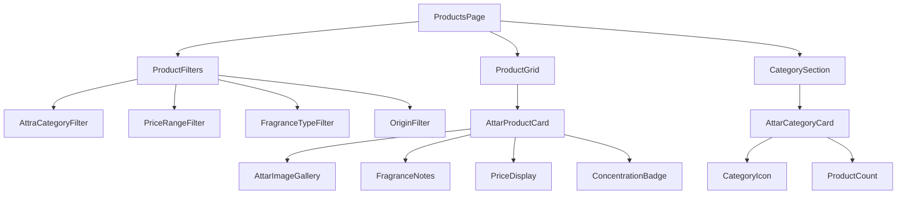
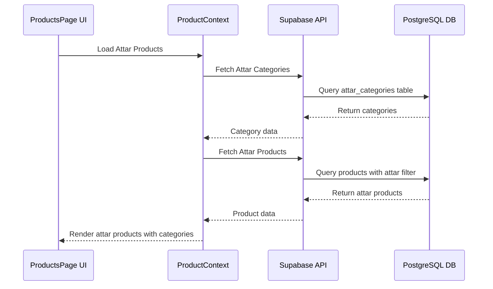

# Product Page Attars Revamp Design

## Overview

This design document outlines the comprehensive revamp of the products page to transform the e-commerce platform into a specialized attars (traditional Indian perfumes) marketplace. The revamp includes replacing existing technology-focused categories with attar-specific categories, implementing Indian pricing structure, and creating 10 different types of attars with authentic descriptions and pricing.

## Technology Stack Analysis

**Frontend Framework**: React 19.1.0 with TypeScript 5.8.3
**Styling**: Tailwind CSS 3.4.1 with luxury design system
**State Management**: Context API pattern
**Backend**: Supabase with PostgreSQL
**Build Tool**: Vite 6.3.5

## Architecture

### Component Architecture



### Data Flow Architecture



## Data Models & ORM Mapping

### Updated Category Structure

| Field | Type | Description | Example |
|-------|------|-------------|---------|
| id | string | Unique identifier | "attar-1" |
| name | string | Category name | "Oudh Attars" |
| slug | string | URL-friendly name | "oudh-attars" |
| description | string | Category description | "Premium oudh-based attars" |
| image | string | Category image URL | High-quality attar bottle image |
| fragrance_family | string | Fragrance classification | "woody", "floral", "oriental" |
| origin_region | string | Geographic origin | "Arabian", "Indian", "Persian" |
| productCount | number | Number of products | 15 |
| isActive | boolean | Category status | true |
| sortOrder | number | Display order | 1-10 |

### Enhanced Product Structure for Attars

| Field | Type | Description | Example |
|-------|------|-------------|---------|
| id | string | Product identifier | "attar-rose-damascus-001" |
| name | string | Attar name | "Rose Damascus Royal Attar" |
| description | string | Detailed description | Traditional rose attar description |
| price | number | Price in INR | 2500.00 |
| originalPrice | number | MRP in INR | 3200.00 |
| category | string | Attar category | "Floral Attars" |
| fragrance_notes | object | Scent profile | {top: ["rose"], middle: ["damask"], base: ["sandalwood"]} |
| concentration | string | Attar strength | "Pure Oil", "Diluted", "Alcohol-Free" |
| volume_ml | number | Volume in milliliters | 12 |
| origin | string | Geographic origin | "Kannauj, India" |
| aging_period | string | Maturation time | "6 months aged" |
| bottle_type | string | Container type | "Crystal bottle with brass cap" |
| gender_profile | string | Target gender | "Unisex", "Masculine", "Feminine" |
| longevity_hours | number | Scent duration | 8 |
| sillage_rating | string | Projection strength | "Moderate", "Strong", "Intimate" |
| tags | array | Search keywords | ["natural", "handcrafted", "premium"] |

## Attar Categories Structure

### 1. Oudh Attars (Agarwood-based)
- **Description**: Premium agarwood-based attars
- **Characteristics**: Deep, woody, complex
- **Price Range**: ₹3,000 - ₹15,000
- **Product Count**: 8 varieties

### 2. Floral Attars
- **Description**: Pure floral essence attars
- **Characteristics**: Fresh, romantic, delicate
- **Price Range**: ₹1,500 - ₹6,000
- **Product Count**: 12 varieties

### 3. Musk Attars
- **Description**: Natural and synthetic musk blends
- **Characteristics**: Sensual, warm, long-lasting
- **Price Range**: ₹2,000 - ₹8,000
- **Product Count**: 6 varieties

### 4. Amber Attars
- **Description**: Rich amber-based compositions
- **Characteristics**: Warm, resinous, oriental
- **Price Range**: ₹2,500 - ₹7,500
- **Product Count**: 5 varieties

### 5. Saffron Attars
- **Description**: Luxury saffron-infused attars
- **Characteristics**: Spicy, precious, exclusive
- **Price Range**: ₹4,000 - ₹12,000
- **Product Count**: 4 varieties

### 6. Sandalwood Attars
- **Description**: Pure sandalwood essence
- **Characteristics**: Creamy, smooth, meditative
- **Price Range**: ₹1,800 - ₹5,500
- **Product Count**: 8 varieties

### 7. Jasmine Attars
- **Description**: Night-blooming jasmine essence
- **Characteristics**: Intoxicating, floral, feminine
- **Price Range**: ₹2,200 - ₹6,500
- **Product Count**: 6 varieties

### 8. Attar Blends
- **Description**: Complex multi-note compositions
- **Characteristics**: Sophisticated, unique, balanced
- **Price Range**: ₹3,500 - ₹10,000
- **Product Count**: 10 varieties

### 9. Seasonal Attars
- **Description**: Season-specific fragrances
- **Characteristics**: Weather-appropriate, seasonal
- **Price Range**: ₹1,200 - ₹4,500
- **Product Count**: 8 varieties

### 10. Heritage Attars
- **Description**: Traditional family recipes
- **Characteristics**: Authentic, aged, rare
- **Price Range**: ₹5,000 - ₹20,000
- **Product Count**: 5 varieties

## Ten Featured Attar Products

### 1. Royal Oudh Al-Maliki
- **Category**: Oudh Attars
- **Price**: ₹12,500
- **Original Price**: ₹15,000
- **Volume**: 12ml
- **Description**: Premium Cambodian oudh aged for 2 years
- **Fragrance Notes**: 
  - Top: Cambodian oudh smoke
  - Middle: Rose damascus
  - Base: White sandalwood
- **Origin**: Kannauj, India
- **Longevity**: 12 hours
- **Sillage**: Strong

### 2. Mysore Sandalwood Supreme
- **Category**: Sandalwood Attars
- **Price**: ₹4,500
- **Original Price**: ₹5,500
- **Volume**: 15ml
- **Description**: Pure Mysore sandalwood oil from 30-year-old trees
- **Fragrance Notes**:
  - Top: Fresh sandalwood
  - Middle: Creamy wood
  - Base: Sweet balsamic
- **Origin**: Mysore, Karnataka
- **Longevity**: 8 hours
- **Sillage**: Moderate

### 3. Bulgarian Rose Attar
- **Category**: Floral Attars
- **Price**: ₹5,800
- **Original Price**: ₹7,200
- **Volume**: 10ml
- **Description**: Steam-distilled Bulgarian rose petals
- **Fragrance Notes**:
  - Top: Fresh rose petals
  - Middle: Damask rose
  - Base: Green stems
- **Origin**: Kannauj, India (Bulgarian rose oil)
- **Longevity**: 6 hours
- **Sillage**: Moderate

### 4. Kashmir Saffron Gold
- **Category**: Saffron Attars
- **Price**: ₹8,900
- **Original Price**: ₹11,000
- **Volume**: 8ml
- **Description**: Premium Kashmir saffron in sandalwood base
- **Fragrance Notes**:
  - Top: Saffron threads
  - Middle: Honey warmth
  - Base: Sandalwood cream
- **Origin**: Kashmir, India
- **Longevity**: 10 hours
- **Sillage**: Strong

### 5. White Musk Tahara
- **Category**: Musk Attars
- **Price**: ₹3,200
- **Original Price**: ₹4,000
- **Volume**: 12ml
- **Description**: Clean white musk with powder undertones
- **Fragrance Notes**:
  - Top: White musk
  - Middle: Soft powder
  - Base: Clean woods
- **Origin**: Arabian Peninsula
- **Longevity**: 8 hours
- **Sillage**: Intimate

### 6. Golden Amber Royale
- **Category**: Amber Attars
- **Price**: ₹6,700
- **Original Price**: ₹8,200
- **Volume**: 10ml
- **Description**: Aged amber resin with spice accents
- **Fragrance Notes**:
  - Top: Golden amber
  - Middle: Warm spices
  - Base: Vanilla woods
- **Origin**: Yemen
- **Longevity**: 12 hours
- **Sillage**: Strong

### 7. Mogra Jasmine Night
- **Category**: Jasmine Attars
- **Price**: ₹4,100
- **Original Price**: ₹5,000
- **Volume**: 12ml
- **Description**: Night-blooming jasmine captured at peak fragrance
- **Fragrance Notes**:
  - Top: Fresh jasmine
  - Middle: Intoxicating florals
  - Base: Green leaves
- **Origin**: Uttar Pradesh, India
- **Longevity**: 7 hours
- **Sillage**: Moderate

### 8. Sultan's Blend Heritage
- **Category**: Attar Blends
- **Price**: ₹9,500
- **Original Price**: ₹12,000
- **Volume**: 15ml
- **Description**: 200-year-old family recipe with 15 natural ingredients
- **Fragrance Notes**:
  - Top: Bergamot, saffron
  - Middle: Rose, oudh, amber
  - Base: Sandalwood, musk, vanilla
- **Origin**: Delhi, India
- **Longevity**: 14 hours
- **Sillage**: Very Strong

### 9. Monsoon Fresh Attar
- **Category**: Seasonal Attars
- **Price**: ₹2,800
- **Original Price**: ₹3,500
- **Volume**: 15ml
- **Description**: Captures the essence of first monsoon rain
- **Fragrance Notes**:
  - Top: Wet earth (petrichor)
  - Middle: Fresh grass
  - Base: Woody earth
- **Origin**: Kerala, India
- **Longevity**: 5 hours
- **Sillage**: Moderate

### 10. Maharaja's Secret
- **Category**: Heritage Attars
- **Price**: ₹18,000
- **Original Price**: ₹22,000
- **Volume**: 6ml
- **Description**: Rare attar from the collection of Maharaja of Mysore
- **Fragrance Notes**:
  - Top: Rare Indian roses
  - Middle: Aged sandalwood
  - Base: Himalayan musk
- **Origin**: Mysore Palace Collection
- **Longevity**: 16 hours
- **Sillage**: Very Strong

## Component Updates

### ProductFilters Component Enhancement

```typescript
interface AttarFilterState {
  category: string;
  priceRange: [number, number]; // INR range: 1000-25000
  fragranceFamily: string[]; // ['floral', 'woody', 'oriental']
  concentration: string[]; // ['pure-oil', 'diluted']
  origin: string[]; // ['kannauj', 'mysore', 'kashmir']
  volume: string[]; // ['6ml', '10ml', '12ml', '15ml']
  longevity: [number, number]; // Hours: 4-16
  gender: string[]; // ['unisex', 'masculine', 'feminine']
  sortBy: string; // 'price-low', 'price-high', 'longevity', 'popularity'
}
```

### ProductCard Component for Attars

Enhanced product card featuring:
- Premium attar bottle imagery
- Fragrance family badges
- Indian pricing display (₹)
- Concentration indicators
- Longevity and sillage ratings
- Origin authenticity badges

### AttraCategoryFilter Component

New filter component specifically for attar categories:
- Fragrance family selection
- Origin region filters
- Concentration level filters
- Volume size options
- Price range in INR

## Pricing Structure

### Indian Rupee Implementation

- **Currency Symbol**: ₹ (Indian Rupee)
- **Price Display Format**: ₹ X,XXX.XX
- **Price Ranges by Category**:
  - Entry Level: ₹1,200 - ₹3,000
  - Premium: ₹3,000 - ₹8,000
  - Luxury: ₹8,000 - ₹15,000
  - Ultra Luxury: ₹15,000+

### Discount Structure

- **Seasonal Sales**: 15-25% off
- **Bulk Purchase**: 10% off on 3+ bottles
- **Festival Offers**: 20-30% off during Diwali, Eid
- **First Purchase**: 10% off for new customers

## UI/UX Design Updates

### Color Palette for Attar Theme

- **Primary**: Deep amber (#D4A574) - representing traditional attar bottles
- **Secondary**: Sandalwood cream (#F5E6D3) - warm, natural
- **Accent**: Royal purple (#6B46C1) - luxury and heritage
- **Text**: Dark brown (#3C2415) - readable, natural
- **Background**: Cream white (#FEFDFB) - clean, elegant

### Typography

- **Headings**: Serif fonts for traditional feel
- **Body Text**: Clean sans-serif for readability
- **Price Display**: Bold, prominent typography
- **Product Names**: Elegant script accents for premium products

### Visual Elements

- **Attar Bottle Icons**: Custom SVG icons for each category
- **Fragrance Visualization**: Olfactory pyramid displays
- **Origin Maps**: Visual indicators of attar origins
- **Authenticity Seals**: Certification badges

## Enhanced Search Functionality

### Attar-Specific Search Features

- **Fragrance Note Search**: Search by specific scent notes
- **Mood-Based Search**: "Romantic", "Meditative", "Energizing"
- **Occasion Search**: "Wedding", "Daily Wear", "Special Events"
- **Ingredient Search**: "Sandalwood", "Rose", "Oudh"
- **Arabic/Urdu Name Search**: Traditional attar names

### Advanced Filtering

- **Scent Strength**: Intimate, Moderate, Strong, Very Strong
- **Longevity Duration**: 4-6h, 6-8h, 8-12h, 12h+
- **Price Range Sliders**: Granular INR ranges
- **Origin Authentication**: Verified sources only
- **Concentration Levels**: Pure oil vs diluted options

## Product Display Enhancements

### Attar-Specific Product Information

- **Olfactory Pyramid**: Visual representation of fragrance notes
- **Aging Information**: Maturation period display
- **Concentration Percentage**: Oil concentration levels
- **Application Guidelines**: Traditional usage instructions
- **Authenticity Certificates**: Origin verification
- **Bottle Information**: Crystal, brass, silver details

### Enhanced Product Grid

- **Premium Card Design**: Luxury aesthetic matching attar heritage
- **Hover Effects**: Bottle rotation, note revelation
- **Quick View**: Fragrance pyramid preview
- **Wishlist Integration**: Save favorite attars
- **Compare Feature**: Side-by-side attar comparison

## Mobile Optimization

### Touch-Optimized Attar Cards

- **Swipe Gestures**: Browse through product images
- **Touch-Friendly Filters**: Easy category selection
- **Voice Search**: Hindi/Urdu attar name recognition
- **Augmented Reality**: Virtual bottle preview
- **Sharing Features**: WhatsApp integration for Indian market

## Testing Strategy

### Component Testing

- **Filter Functionality**: Category and price filtering accuracy
- **Search Performance**: Attar-specific search relevance
- **Price Display**: INR formatting and conversion
- **Mobile Responsiveness**: Touch interaction testing
- **Load Performance**: Image optimization for attar galleries

### User Experience Testing

- **Navigation Flow**: Category browsing efficiency
- **Purchase Journey**: Add-to-cart through checkout
- **Search Accuracy**: Fragrance note search results
- **Mobile Performance**: Gesture responsiveness
- **Accessibility**: Screen reader compatibility

## Database Schema Updates

### New Attar-Specific Tables

```sql
-- Enhanced categories table for attars
CREATE TABLE attar_categories (
  id UUID PRIMARY KEY DEFAULT gen_random_uuid(),
  name VARCHAR(100) NOT NULL,
  slug VARCHAR(100) UNIQUE NOT NULL,
  description TEXT,
  image_url TEXT,
  fragrance_family VARCHAR(50), -- 'floral', 'woody', 'oriental', 'fresh'
  origin_region VARCHAR(100),
  parent_id UUID REFERENCES attar_categories(id),
  is_active BOOLEAN DEFAULT true,
  sort_order INTEGER DEFAULT 0,
  product_count INTEGER DEFAULT 0,
  created_at TIMESTAMP WITH TIME ZONE DEFAULT NOW(),
  updated_at TIMESTAMP WITH TIME ZONE DEFAULT NOW()
);

-- Enhanced products table with attar-specific fields
ALTER TABLE products ADD COLUMN IF NOT EXISTS fragrance_notes JSONB;
ALTER TABLE products ADD COLUMN IF NOT EXISTS concentration VARCHAR(50);
ALTER TABLE products ADD COLUMN IF NOT EXISTS volume_ml INTEGER;
ALTER TABLE products ADD COLUMN IF NOT EXISTS origin VARCHAR(100);
ALTER TABLE products ADD COLUMN IF NOT EXISTS aging_period VARCHAR(100);
ALTER TABLE products ADD COLUMN IF NOT EXISTS bottle_type VARCHAR(100);
ALTER TABLE products ADD COLUMN IF NOT EXISTS gender_profile VARCHAR(20);
ALTER TABLE products ADD COLUMN IF NOT EXISTS longevity_hours INTEGER;
ALTER TABLE products ADD COLUMN IF NOT EXISTS sillage_rating VARCHAR(20);
ALTER TABLE products ADD COLUMN IF NOT EXISTS authenticity_certificate TEXT;
ALTER TABLE products ADD COLUMN IF NOT EXISTS distillation_method VARCHAR(100);

-- Fragrance notes lookup table
CREATE TABLE fragrance_notes (
  id UUID PRIMARY KEY DEFAULT gen_random_uuid(),
  name VARCHAR(100) NOT NULL UNIQUE,
  category VARCHAR(50) NOT NULL, -- 'top', 'middle', 'base'
  description TEXT,
  is_natural BOOLEAN DEFAULT true,
  created_at TIMESTAMP WITH TIME ZONE DEFAULT NOW()
);

-- Product fragrance notes junction table
CREATE TABLE product_fragrance_notes (
  product_id UUID REFERENCES products(id) ON DELETE CASCADE,
  fragrance_note_id UUID REFERENCES fragrance_notes(id) ON DELETE CASCADE,
  intensity INTEGER CHECK (intensity BETWEEN 1 AND 5),
  note_position VARCHAR(20), -- 'top', 'middle', 'base'
  PRIMARY KEY (product_id, fragrance_note_id)
);

-- Attar reviews with fragrance-specific ratings
ALTER TABLE reviews ADD COLUMN IF NOT EXISTS longevity_rating INTEGER CHECK (longevity_rating BETWEEN 1 AND 5);
ALTER TABLE reviews ADD COLUMN IF NOT EXISTS sillage_rating INTEGER CHECK (sillage_rating BETWEEN 1 AND 5);
ALTER TABLE reviews ADD COLUMN IF NOT EXISTS authenticity_rating INTEGER CHECK (authenticity_rating BETWEEN 1 AND 5);
ALTER TABLE reviews ADD COLUMN IF NOT EXISTS value_rating INTEGER CHECK (value_rating BETWEEN 1 AND 5);
```

### RLS Policies for Attar Data

```sql
-- Enable RLS on new tables
ALTER TABLE attar_categories ENABLE ROW LEVEL SECURITY;
ALTER TABLE fragrance_notes ENABLE ROW LEVEL SECURITY;
ALTER TABLE product_fragrance_notes ENABLE ROW LEVEL SECURITY;

-- Public read access for active categories
CREATE POLICY "Public can view active attar categories" ON attar_categories
  FOR SELECT USING (is_active = true);

-- Sellers can manage their products' fragrance notes
CREATE POLICY "Sellers can manage their product fragrance notes" ON product_fragrance_notes
  FOR ALL USING (
    product_id IN (
      SELECT id FROM products WHERE seller_id = auth.uid()
    )
  );
```

## API Endpoints Reference

### Attar Category Endpoints

```typescript
// GET /api/categories/attars
interface AttarCategoriesResponse {
  categories: AttarCategory[];
  total: number;
  fragranceFamilies: string[];
  originRegions: string[];
}

// GET /api/categories/attars/:slug
interface AttarCategoryResponse {
  category: AttarCategory;
  products: AttarProduct[];
  relatedCategories: AttarCategory[];
}
```

### Attar Product Endpoints

```typescript
// GET /api/products/attars
interface AttarProductsRequest {
  category?: string;
  priceMin?: number;
  priceMax?: number;
  fragranceFamily?: string[];
  concentration?: string[];
  origin?: string[];
  volumeRange?: [number, number];
  longevityMin?: number;
  gender?: string[];
  sortBy?: 'price_asc' | 'price_desc' | 'longevity' | 'popularity' | 'newest';
  page?: number;
  limit?: number;
}

// GET /api/products/attars/:id/fragrance-profile
interface FragranceProfileResponse {
  pyramid: {
    top: FragranceNote[];
    middle: FragranceNote[];
    base: FragranceNote[];
  };
  concentration: string;
  longevity: number;
  sillage: string;
  seasonalRecommendation: string[];
}
```

### Enhanced Search Endpoints

```typescript
// POST /api/search/attars/semantic
interface SemanticSearchRequest {
  query: string; // "romantic evening fragrance"
  mood?: string; // "romantic", "energizing", "calming"
  occasion?: string; // "wedding", "daily", "special"
  season?: string; // "summer", "winter", "monsoon"
  budget?: [number, number];
}

// GET /api/search/attars/similar/:productId
interface SimilarAttarsResponse {
  similarProducts: AttarProduct[];
  similarityScore: number;
  matchingNotes: string[];
}
```

## Advanced Component Architecture

### AttarProductCard Component

```typescript
interface AttarProductCardProps {
  product: AttarProduct;
  variant?: 'grid' | 'list' | 'featured' | 'comparison';
  showFragrancePyramid?: boolean;
  showQuickActions?: boolean;
  onQuickView?: (product: AttarProduct) => void;
  onAddToComparison?: (product: AttarProduct) => void;
}

interface AttarProduct extends Product {
  fragranceNotes: {
    top: string[];
    middle: string[];
    base: string[];
  };
  concentration: 'pure-oil' | 'diluted' | 'alcohol-free';
  volumeMl: number;
  origin: string;
  agingPeriod?: string;
  bottleType: string;
  genderProfile: 'unisex' | 'masculine' | 'feminine';
  longevityHours: number;
  sillageRating: 'intimate' | 'moderate' | 'strong' | 'very-strong';
  authenticityCertificate?: string;
  distillationMethod?: string;
}
```

### FragrancePyramid Component

```typescript
interface FragrancePyramidProps {
  notes: {
    top: FragranceNote[];
    middle: FragranceNote[];
    base: FragranceNote[];
  };
  interactive?: boolean;
  size?: 'small' | 'medium' | 'large';
  showIntensity?: boolean;
}

interface FragranceNote {
  id: string;
  name: string;
  description?: string;
  intensity: 1 | 2 | 3 | 4 | 5;
  isNatural: boolean;
  category: 'floral' | 'woody' | 'spicy' | 'fresh' | 'oriental';
}
```

### AttarFilterPanel Component

```typescript
interface AttarFilterPanelProps {
  filters: AttarFilterState;
  onFiltersChange: (filters: AttarFilterState) => void;
  categories: AttarCategory[];
  priceRange: [number, number];
  availableOrigins: string[];
  availableConcentrations: string[];
  availableVolumes: number[];
}

interface AttarFilterState {
  categories: string[];
  priceRange: [number, number];
  fragranceFamilies: string[];
  concentrations: string[];
  origins: string[];
  volumes: number[];
  longevityRange: [number, number];
  genderProfiles: string[];
  sillageRatings: string[];
  hasAuthenticity: boolean;
  inStock: boolean;
  onSale: boolean;
  sortBy: string;
}
```

## State Management Updates

### AttarContext Provider

```typescript
interface AttarContextType {
  // Products
  attars: AttarProduct[];
  featuredAttars: AttarProduct[];
  categories: AttarCategory[];
  fragranceNotes: FragranceNote[];
  
  // Loading states
  loading: boolean;
  categoriesLoading: boolean;
  
  // Actions
  fetchAttars: (filters?: AttarFilterState) => Promise<void>;
  fetchAttarById: (id: string) => Promise<AttarProduct | null>;
  fetchSimilarAttars: (productId: string) => Promise<AttarProduct[]>;
  searchAttarsByMood: (mood: string) => Promise<AttarProduct[]>;
  
  // Fragrance analysis
  analyzeFragranceCompatibility: (productIds: string[]) => Promise<CompatibilityScore>;
  getSeasonalRecommendations: (season: string) => Promise<AttarProduct[]>;
}
```

### Enhanced Cart Context for Attars

```typescript
interface AttarCartItem extends CartItem {
  fragranceProfile?: {
    dominantFamily: string;
    seasonality: string[];
    occasions: string[];
  };
  giftWrapping?: {
    enabled: boolean;
    message?: string;
    premium?: boolean;
  };
  samplingOption?: {
    requested: boolean;
    sampleSize: '1ml' | '2ml';
  };
}
```

## Enhanced Search & Discovery

### Mood-Based Search Algorithm

```typescript
interface MoodMapping {
  romantic: {
    fragranceFamilies: ['floral', 'oriental'];
    notes: ['rose', 'jasmine', 'amber', 'vanilla'];
    concentration: ['pure-oil'];
    longevityMin: 6;
  };
  energizing: {
    fragranceFamilies: ['fresh', 'citrus'];
    notes: ['bergamot', 'lemon', 'mint', 'eucalyptus'];
    sillage: ['moderate', 'strong'];
  };
  meditative: {
    fragranceFamilies: ['woody', 'oriental'];
    notes: ['sandalwood', 'frankincense', 'oudh'];
    origins: ['india', 'arabia'];
  };
}
```

### Semantic Search Implementation

```typescript
interface SemanticSearchEngine {
  processNaturalLanguageQuery: (query: string) => SearchIntent;
  matchFragranceDescriptions: (intent: SearchIntent) => AttarProduct[];
  rankByRelevance: (products: AttarProduct[], intent: SearchIntent) => AttarProduct[];
}

interface SearchIntent {
  fragranceFamily?: string[];
  mood?: string;
  occasion?: string;
  season?: string;
  intensity?: 'light' | 'medium' | 'strong';
  pricePreference?: 'budget' | 'mid-range' | 'luxury';
}
```

## Internationalization for Indian Market

### Multi-Language Support

```typescript
interface AttarTranslations {
  en: {
    productNames: Record<string, string>;
    fragranceNotes: Record<string, string>;
    descriptions: Record<string, string>;
  };
  hi: {
    productNames: Record<string, string>; // Hindi names
    fragranceNotes: Record<string, string>;
    descriptions: Record<string, string>;
  };
  ur: {
    productNames: Record<string, string>; // Urdu names
    fragranceNotes: Record<string, string>;
    descriptions: Record<string, string>;
  };
}
```

### Regional Pricing

```typescript
interface RegionalPricing {
  basePrice: number; // INR
  regionalAdjustments: {
    northIndia: 1.0; // Base price
    southIndia: 0.95; // 5% discount
    westIndia: 1.05; // 5% premium
    eastIndia: 0.9; // 10% discount
  };
  bulkDiscounts: {
    quantity2: 0.05; // 5% off for 2+ items
    quantity3: 0.1; // 10% off for 3+ items
    quantity5: 0.15; // 15% off for 5+ items
  };
}
```

## Performance Optimizations

### Image Optimization for Attar Products

```typescript
interface AttarImageOptimization {
  formats: ['webp', 'avif', 'jpg'];
  sizes: {
    thumbnail: { width: 150, height: 150 };
    card: { width: 300, height: 300 };
    detail: { width: 600, height: 600 };
    zoom: { width: 1200, height: 1200 };
  };
  lazyLoading: true;
  preloadStrategy: 'featured-products' | 'visible-viewport';
}
```

### Caching Strategy

```typescript
interface AttarCacheStrategy {
  categories: {
    ttl: '1 hour';
    strategy: 'cache-first';
  };
  products: {
    ttl: '30 minutes';
    strategy: 'stale-while-revalidate';
  };
  fragranceNotes: {
    ttl: '24 hours';
    strategy: 'cache-first';
  };
  search: {
    ttl: '15 minutes';
    strategy: 'network-first';
  };
}
```

## Analytics & Business Intelligence

### Attar-Specific Analytics

```typescript
interface AttarAnalytics {
  popularFragranceFamilies: {
    family: string;
    viewCount: number;
    purchaseCount: number;
    conversionRate: number;
  }[];
  
  seasonalTrends: {
    season: string;
    topCategories: string[];
    averageOrderValue: number;
    popularPriceRange: [number, number];
  }[];
  
  regionalPreferences: {
    region: string;
    preferredOrigins: string[];
    averageSpending: number;
    popularConcentrations: string[];
  }[];
}
```

### Conversion Tracking

```typescript
interface ConversionEvents {
  'attar_category_view': { category: string; source: string };
  'fragrance_pyramid_interaction': { productId: string; noteClicked: string };
  'mood_search_used': { mood: string; resultsCount: number };
  'authenticity_certificate_viewed': { productId: string };
  'compare_attars': { productIds: string[]; finalSelection?: string };
  'sample_requested': { productId: string; sampleSize: string };
}
```

## Implementation Phases

### Phase 1: Data Migration & Core Setup (Week 1)
- Update database schema with attar-specific fields
- Migrate existing product data to new structure
- Implement INR pricing system
- Create 10 featured attar products with authentic details
- Set up fragrance notes database

### Phase 2: UI Component Development (Week 2)
- Redesign ProductCard component for attar display
- Implement FragrancePyramid component
- Update ProductFilters with attar-specific options
- Enhance search functionality with mood-based search
- Mobile optimization for touch interactions

### Phase 3: Advanced Features & Analytics (Week 3)
- Implement semantic search engine
- Add fragrance compatibility analysis
- Create authenticity verification system
- Set up regional pricing logic
- Implement attar-specific analytics

### Phase 4: Testing, Optimization & Launch (Week 4)
- Performance testing and optimization
- Cross-browser compatibility testing
- Mobile device testing across different screen sizes
- User acceptance testing with attar enthusiasts
- Production deployment and monitoring setup