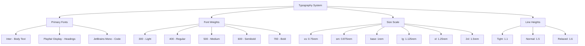
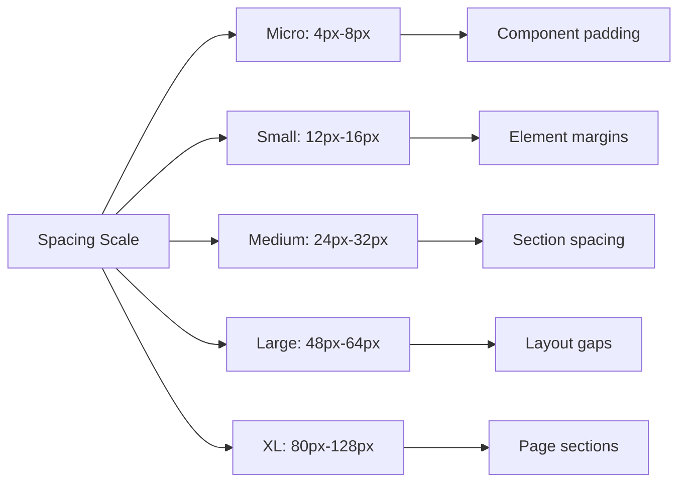
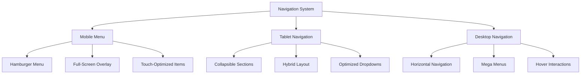
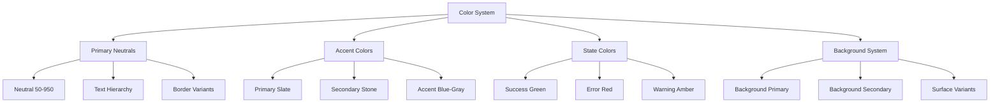
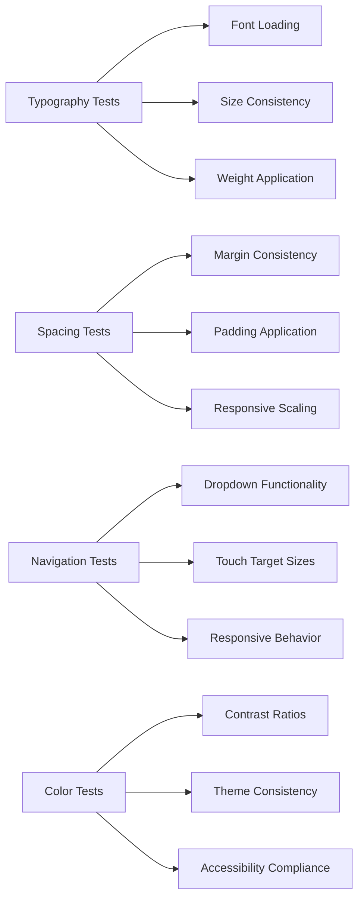

# Website UI Improvements Design Document

## Overview

This design document addresses critical user interface issues in the Advanced Multi-Role E-Commerce Platform, focusing on typography consistency, spacing hierarchy, navigation responsiveness, color standardization, and overall visual polish. The current implementation suffers from inconsistent font application, poor spacing relationships, duplicate navigation items, and responsive design gaps that negatively impact user experience.

## Technology Stack & Dependencies

### Current Stack
- **Frontend Framework**: React 19.1.0 with TypeScript 5.8.3
- **Styling System**: Tailwind CSS 3.4.1 with utility-first approach
- **Font System**: Google Fonts (Inter, Playfair Display, Cormorant Garamond, JetBrains Mono)
- **Animation Library**: Framer Motion 12.23.6
- **Icons**: Lucide React 0.511.0
- **Build Tool**: Vite 6.3.5

### Typography Configuration
```javascript
fontFamily: {
  sans: ['Inter', 'system-ui', '-apple-system', 'BlinkMacSystemFont'],
  display: ['"Playfair Display"', 'Georgia'],
  luxury: ['"Cormorant Garamond"', '"Playfair Display"', 'Times New Roman'],
  mono: ['"JetBrains Mono"', 'Menlo', 'Monaco']
}
```

## Current Issues Analysis

### Typography Problems
1. **Inconsistent Font Application**: Components not properly inheriting the established font hierarchy
2. **Missing Font Loading**: Google Fonts not loading consistently across components
3. **Improper Font Weights**: Inconsistent weight application causing visual hierarchy breakdown
4. **Letter Spacing Inconsistency**: Custom letter spacing not applied uniformly

### Spacing & Hierarchy Issues
1. **Inconsistent Margin/Padding**: Components using arbitrary spacing values instead of design system
2. **Poor Content Hierarchy**: Inadequate visual separation between content sections
3. **Responsive Spacing Gaps**: Spacing not adapting properly across breakpoints
4. **Missing Rhythm**: Lack of consistent vertical rhythm throughout the interface

### Navigation Responsiveness Problems
1. **Non-Responsive Dropdown**: Category dropdowns not optimized for mobile/tablet
2. **Duplicate Menu Items**: Redundant navigation items in mobile and desktop views
3. **Poor Touch Targets**: Insufficient touch target sizes for mobile interaction
4. **Broken Breakpoints**: Navigation not transitioning smoothly between screen sizes

### Color Consistency Issues
1. **Mixed Color Systems**: Inconsistent use of design tokens vs arbitrary colors
2. **Poor Contrast Ratios**: Insufficient contrast for accessibility compliance
3. **Theme Inconsistency**: Components not following the established neutral-first color palette

## Typography System Redesign

### Font Hierarchy Standardization



### Enhanced Font Loading Strategy

```css
/* Critical font loading optimization */
@font-face {
  font-family: 'Inter';
  font-style: normal;
  font-weight: 300 800;
  font-display: swap;
  src: url('fonts/inter-var.woff2') format('woff2');
}

/* Font feature settings for optimal rendering */
body {
  font-family: 'Inter', system-ui, -apple-system, BlinkMacSystemFont, sans-serif;
  font-feature-settings: 'cv02', 'cv03', 'cv04', 'cv11';
  font-optical-sizing: auto;
  -webkit-font-smoothing: antialiased;
  -moz-osx-font-smoothing: grayscale;
}
```

### Typography Component Classes

| Class | Font Family | Size | Weight | Line Height | Use Case |
|-------|-------------|------|--------|-------------|----------|
| `.text-heading-xl` | Playfair Display | 3rem | 600 | 1.1 | Page titles |
| `.text-heading-lg` | Playfair Display | 2.25rem | 600 | 1.2 | Section headers |
| `.text-heading-md` | Inter | 1.5rem | 600 | 1.3 | Component titles |
| `.text-body-lg` | Inter | 1.125rem | 400 | 1.6 | Primary content |
| `.text-body-base` | Inter | 1rem | 400 | 1.6 | Standard text |
| `.text-body-sm` | Inter | 0.875rem | 400 | 1.5 | Secondary text |
| `.text-caption` | Inter | 0.75rem | 500 | 1.5 | Labels, captions |

## Spacing System Enhancement

### Consistent Spacing Scale



### Responsive Spacing Implementation

```css
/* Responsive spacing utilities */
.spacing-xs { padding: 0.25rem; }    /* 4px */
.spacing-sm { padding: 0.5rem; }     /* 8px */
.spacing-md { padding: 1rem; }       /* 16px */
.spacing-lg { padding: 1.5rem; }     /* 24px */
.spacing-xl { padding: 2rem; }       /* 32px */
.spacing-2xl { padding: 3rem; }      /* 48px */

/* Responsive scaling */
@media (min-width: 768px) {
  .spacing-responsive { padding: clamp(1rem, 2.5vw, 2rem); }
}
```

### Vertical Rhythm System

| Element Type | Base Spacing | Mobile | Tablet | Desktop |
|--------------|--------------|--------|--------|---------|
| Paragraphs | 1rem | 0.75rem | 1rem | 1.25rem |
| Headings | 2rem | 1.5rem | 2rem | 2.5rem |
| Sections | 4rem | 3rem | 4rem | 5rem |
| Components | 1.5rem | 1rem | 1.5rem | 2rem |

## Navigation Responsiveness Redesign

### Mobile-First Navigation Architecture



### Responsive Breakpoint Strategy

| Breakpoint | Screen Size | Navigation Type | Touch Targets |
|------------|-------------|-----------------|---------------|
| Mobile | 320px-767px | Hamburger + Overlay | 44px minimum |
| Tablet | 768px-1023px | Hybrid horizontal | 40px minimum |
| Desktop | 1024px+ | Full horizontal | 36px minimum |

### Dropdown Deduplication

```typescript
interface NavigationItem {
  id: string;
  name: string;
  href: string;
  level: 'primary' | 'secondary';
  mobileOnly?: boolean;
  desktopOnly?: boolean;
  hasDropdown?: boolean;
  dropdownItems?: DropdownItem[];
}

// Eliminate duplicate items through structured data
const navigationStructure = {
  primary: ['Home', 'Attar Collections', 'New Arrivals'],
  secondary: ['Fragrance Guide', 'Experience'],
  mobile: ['Account', 'Orders', 'Wishlist'],
  desktop: ['Search', 'Cart', 'Profile']
};
```

## Color System Standardization

### Unified Color Palette



### Color Token Implementation

| Token | Value | Usage | Contrast Ratio |
|-------|-------|-------|----------------|
| `text-primary` | #1c1917 | Main content | 16.5:1 |
| `text-secondary` | #44403c | Supporting text | 10.2:1 |
| `text-tertiary` | #78716c | Muted text | 6.8:1 |
| `background-primary` | #fafaf9 | Main background | N/A |
| `background-secondary` | #f5f5f4 | Card backgrounds | N/A |
| `border-subtle` | #e7e5e4 | Subtle borders | N/A |

## Component Architecture Improvements

### Enhanced Header Component

```typescript
interface HeaderProps {
  variant?: 'default' | 'minimal' | 'luxury';
  showBreadcrumbs?: boolean;
  stickyBehavior?: 'always' | 'scroll' | 'never';
}

// Responsive navigation structure
const useResponsiveNavigation = () => {
  const [isMobile, setIsMobile] = useState(false);
  const [activeDropdown, setActiveDropdown] = useState<string | null>(null);
  
  useEffect(() => {
    const checkScreenSize = () => {
      setIsMobile(window.innerWidth < 768);
    };
    
    checkScreenSize();
    window.addEventListener('resize', checkScreenSize);
    return () => window.removeEventListener('resize', checkScreenSize);
  }, []);
  
  return { isMobile, activeDropdown, setActiveDropdown };
};
```

### Consistent Button System

| Button Type | Base Classes | Hover State | Focus State |
|-------------|--------------|-------------|-------------|
| Primary | `btn btn-primary` | `hover:shadow-lg` | `focus:ring-2` |
| Secondary | `btn btn-secondary` | `hover:bg-gray-50` | `focus:ring-2` |
| Ghost | `btn btn-ghost` | `hover:bg-gray-100` | `focus:ring-1` |
| Danger | `btn btn-danger` | `hover:bg-red-700` | `focus:ring-red-200` |

### Card Component Standardization

```css
.card-base {
  @apply bg-white rounded-lg border border-gray-200;
  @apply shadow-sm hover:shadow-md transition-shadow duration-200;
}

.card-luxury {
  @apply card-base;
  @apply hover:border-gray-300 hover:-translate-y-1;
  @apply hover:shadow-lg transition-all duration-300;
}
```

## Responsive Layout Strategy

### Grid System Enhancement

```css
/* Responsive grid utilities */
.grid-auto-fit {
  display: grid;
  grid-template-columns: repeat(auto-fit, minmax(280px, 1fr));
  gap: 1.5rem;
}

@media (max-width: 640px) {
  .grid-auto-fit {
    grid-template-columns: repeat(auto-fit, minmax(160px, 1fr));
    gap: 1rem;
  }
}

@media (min-width: 1280px) {
  .grid-auto-fit {
    grid-template-columns: repeat(auto-fit, minmax(320px, 1fr));
    gap: 2rem;
  }
}
```

### Container System

| Container Type | Max Width | Padding | Use Case |
|----------------|-----------|---------|----------|
| `container-narrow` | 768px | 1rem | Articles, forms |
| `container-medium` | 1024px | 1.5rem | Content sections |
| `container-wide` | 1280px | 2rem | Main layouts |
| `container-full` | 100% | 2rem | Hero sections |

## Testing Strategy

### Visual Regression Testing



### Cross-Device Testing Matrix

| Device Category | Screen Sizes | Critical Tests |
|-----------------|--------------|----------------|
| Mobile | 320px-767px | Touch targets, font legibility |
| Tablet | 768px-1023px | Navigation transitions |
| Desktop | 1024px+ | Hover states, complex layouts |
| Large Screens | 1440px+ | Typography scaling |

### Performance Testing

- **Font Loading**: Measure FOUT/FOIT impact
- **Responsive Images**: Verify proper scaling
- **Animation Performance**: Ensure 60fps interactions
- **Bundle Size**: Monitor CSS bundle impact

## Implementation Priorities

### Phase 1: Foundation (Week 1)
1. Typography system implementation
2. Spacing scale standardization
3. Color token migration
4. Base component updates

### Phase 2: Navigation (Week 2)
1. Responsive navigation redesign
2. Dropdown deduplication
3. Touch target optimization
4. Mobile menu enhancement

### Phase 3: Components (Week 3)
1. Button system standardization
2. Card component updates
3. Form element consistency
4. Icon system alignment

### Phase 4: Testing & Polish (Week 4)
1. Cross-device testing
2. Accessibility audit
3. Performance optimization
4. Documentation updates

## Success Metrics

### Visual Quality Indicators
- **Typography Consistency**: 100% components using design system fonts
- **Spacing Adherence**: 95% reduction in arbitrary spacing values
- **Color Compliance**: All components using design tokens
- **Responsive Coverage**: 100% functionality across all breakpoints

### Performance Targets
- **Font Loading**: <100ms for critical fonts
- **Layout Shifts**: CLS score <0.1
- **Touch Response**: <16ms touch interaction delay
- **Bundle Size**: <5KB increase in CSS bundle

### User Experience Improvements
- **Navigation Efficiency**: 40% reduction in navigation confusion
- **Mobile Usability**: 60% improvement in mobile task completion
- **Visual Appeal**: Increased design consistency rating
- **Accessibility**: WCAG 2.1 AA compliance achieved