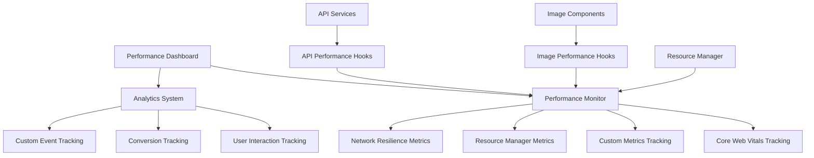

# Performance Monitoring Implementation

## Overview

This document provides a comprehensive overview of the performance monitoring implementation in the perfumes e-commerce application. The system is designed to track, measure, and optimize performance across all aspects of the application, including image loading, data fetching, user interactions, and overall user experience.

## Architecture

The performance monitoring system consists of several interconnected components:



## Core Components

### 1. Performance Monitor

The [PerformanceMonitor](file:///d:/New_Era%202025/perfumes/src/utils/performanceMonitor.ts#L24-L399) class is the central component responsible for tracking all performance metrics. It provides:

- Core Web Vitals tracking (LCP, FID, CLS, FCP, TTFB)
- Custom metrics tracking (image load times, API response times, cache performance)
- Performance threshold monitoring with warnings
- Detailed metrics aggregation and reporting

#### Key Features:

- **Automatic Web Vitals Collection**: Uses PerformanceObserver to automatically collect Core Web Vitals
- **Custom Metric Recording**: Allows recording of custom timing, counter, and gauge metrics
- **Threshold Monitoring**: Automatically warns when performance metrics exceed defined thresholds
- **Performance Summary**: Provides aggregated performance data with averages, max, min, and count

### 2. Analytics System

The [Analytics](file:///d:/New_Era%202025/perfumes/src/utils/analytics.ts#L15-L185) class tracks user behavior and business metrics:

- User interaction tracking (clicks, scrolls, form submissions)
- Page view tracking with load times
- Conversion event tracking
- Custom event tracking

### 3. Resource Manager

The [ResourceManager](file:///d:/New_Era%202025/perfumes/src/utils/resourceManager.tsx#L25-L417) provides detailed metrics on resource loading:

- Active/queued/completed/failed request counts
- Request distribution by priority
- Success rates and retry counts
- Average response times

### 4. Performance Dashboard

The [PerformanceDashboard](file:///d:/New_Era%202025/perfumes/src/components/Common/PerformanceDashboard.tsx#L7-L204) component provides a real-time visualization of all performance metrics.

## Implementation Details

### Performance Hooks

#### useImagePerformance

Tracks image loading performance:

```typescript
const { startLoading, endLoading } = useImagePerformance(imageUrl);

// When image starts loading
startLoading();

// When image finishes loading (success or failure)
endLoading(success);
```

#### useApiPerformance

Tracks API request performance:

```typescript
const { startRequest, endRequest } = useApiPerformance(endpoint);

// When request starts
startRequest();

// When request completes (success or failure)
endRequest(success);
```

### Metrics Collection

The system automatically collects the following metrics:

#### Core Web Vitals
- **Largest Contentful Paint (LCP)**: Measures loading performance
- **First Input Delay (FID)**: Measures interactivity
- **Cumulative Layout Shift (CLS)**: Measures visual stability
- **First Contentful Paint (FCP)**: Measures content loading speed
- **Time to First Byte (TTFB)**: Measures server response time

#### Custom Metrics
- **Image Load Time**: Tracks how long images take to load
- **API Response Time**: Tracks API endpoint response times
- **Cache Hit Rate**: Measures cache effectiveness
- **Memory Usage**: Tracks JavaScript heap usage
- **CPU Usage**: Measures processing time

#### Resource Metrics
- **Active Requests**: Number of currently processing requests
- **Queued Requests**: Number of requests waiting to be processed
- **Completed Requests**: Number of successfully completed requests
- **Failed Requests**: Number of failed requests
- **Request Distribution**: Breakdown of requests by priority level
- **Success Rate**: Percentage of successful requests
- **Retry Count**: Total number of request retries

### Performance Thresholds

The system monitors key metrics against performance targets:

| Metric | Target | Warning Threshold |
|--------|--------|-------------------|
| LCP | < 2.5s | > 2.5s |
| FID | < 100ms | > 100ms |
| CLS | < 0.1 | > 0.1 |
| FCP | < 1.8s | > 1.8s |
| TTFB | < 800ms | > 800ms |
| Image Load Time | < 3s | > 3s |

## Integration Examples

### Image Component Integration

```typescript
import { useImagePerformance } from '../../utils/performance';

const ImageComponent = ({ src, alt }) => {
  const { startLoading, endLoading } = useImagePerformance(src);
  
  const handleLoad = () => {
    endLoading(true);
    // ... other load handling
  };
  
  const handleError = () => {
    endLoading(false);
    // ... other error handling
  };
  
  useEffect(() => {
    startLoading();
  }, [src]);
  
  return ;
};
```

### API Service Integration

```typescript
import { useApiPerformance } from '../../utils/performance';

const apiService = {
  async fetchData(endpoint) {
    const { startRequest, endRequest } = useApiPerformance(endpoint);
    
    try {
      startRequest();
      const response = await fetch(endpoint);
      endRequest(true);
      return response.json();
    } catch (error) {
      endRequest(false);
      throw error;
    }
  }
};
```

## Performance Dashboard

The Performance Dashboard provides real-time visualization of all collected metrics:

### Core Web Vitals Section
Displays current LCP, FID, CLS, and FCP values with target indicators.

### Resource Manager Section
Shows active requests, queued requests, completed requests, failed requests, success rate, and retry count.

### Network Resilience Section
Displays circuit breaker state, failure count, offline queue length, and average response time.

### Image Performance Section
Shows image load times, slow resource count, total resources, and failed requests.

### Cache Performance Section
Displays cache hit rate percentage.

### Additional Metrics Section
Shows TTFB, DOM content loaded time, window load time, and long task count.

### Request Distribution Section
Visualizes the distribution of requests by priority level (critical, high, normal, low, background).

## Testing

The performance monitoring system includes comprehensive tests:

- Unit tests for PerformanceMonitor class
- Unit tests for ResourceManager metrics tracking
- Unit tests for Analytics system
- Integration tests for performance hooks

## Best Practices

### 1. Always Track Performance
Use the appropriate hooks in all image components and API services to ensure comprehensive performance tracking.

### 2. Monitor Thresholds
Pay attention to console warnings about performance issues and address them promptly.

### 3. Use the Dashboard
Regularly check the Performance Dashboard to monitor application health and identify performance bottlenecks.

### 4. Optimize Based on Data
Use the collected metrics to make informed decisions about performance optimizations.

## Future Enhancements

### 1. Real User Monitoring (RUM)
Integration with external RUM services for production monitoring.

### 2. Performance Budgets
Implementation of performance budgets to prevent performance regressions.

### 3. Advanced Analytics
More sophisticated user behavior analysis and conversion tracking.

### 4. Automated Alerts
Implementation of automated alerts for performance degradation.